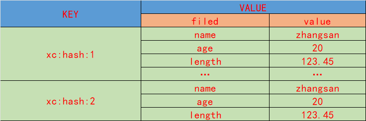

## Hash 类型

hash 是值得是redis的值的结构，就是一个hash表/map/dict
xc_redis:{"name","xc","age":18}

## Hash 的数据结构


### 常用的Hash结构的操作命令

- HSET 添加或修改hash类型的字段值

```redis
 HSET key field value
 summary: Set the string value of a hash field
 -- 只能设置一堆 field - val

 127.0.0.1:6379> hset xc:hash_list name zhangsan
 (integer) 1
  
```

- HGET 获取hash类型的字段值

```redis
 HGET key field
 summary: Get the value of a hash field

 -- 获取某个hsah类型的key下面 xx 字段的值

 127.0.0.1:6379> HGET xc:hash_list name
 "zhangsan"
 127.0.0.1:6379> HGET xc:hash_list1 name
 (nil)
```

- HMSET 设置多哈希类型key的字段值

```redis
 HMSET key field value [field value ...]
 summary: Set multiple hash fields to their respective values
 -- 设置一个hash类型的key，包含多个键值对

 127.0.0.1:6379> hmset xc:hassh_list name yuyu age 20 len 123.45
 OK
```

- HMGET 获取多个hash类型key的字段值

```redis
  HMGET key field [field ...]
 summary: Get the values of all the given hash fields

 -- 同时获取一个hash类型的key的 多个字段的值
 127.0.0.1:6379> hmget xc:hassh_list age name len data
 1) "20"
 2) "yuyu"
 3) "123.45"
 4) (nil)
```

- HGETALL 获取一个hash类型的key中所有字段和值

```redis
 HGETALL key
 summary: Get all the fields and values in a hash

 --  获取所有字段和值 第一个是字段 第二个是值
 127.0.0.1:6379> hgetall xc:hassh_list
 1) "name"
 2) "yuyu"
 3) "age"
 4) "20"
 5) "len"
 6) "123.45"
```

- HKEYS 获取hash类型的key的所有字段名

```redis
 HKEYS key
 summary: Get all the fields in a hash
 -- 获取所有字段名 fileds1 fileds2 。。。。
 127.0.0.1:6379> hkeys xc:hassh_list
 127.0.0.1:6379> hkeys xc:hassh_list
 1) "name"
 2) "age"
 3) "len"
```

- HVALS 获取所有hash类型的 值 序列

```redis
 HVALS key
 summary: Get all the values in a hash
 -- 获取所有值
 127.0.0.1:6379> hvals xc:hassh_list
 1) "yuyu"
 2) "20"
 3) "123.45"
```

- HINCRBY 让hash类型类型key的某个字段值增加 指定长度
```redis

 HINCRBY key field increment
 summary: Increment the integer value of a hash field by the given number
 -- 将hash类型的key的某个字段值增加 10(这个字段必须是数字类型)
 127.0.0.1:6379> hincrby xc:hassh_list age 10
 "30"
```
- HSETNX 设置一个Hash值，如果不存在的话
```redis
    HSETNX key field value
 summary: Set the value of a hash field, only if the field does not exist
 -- 设置一个Hash值，如果不存在的话
 127.0.0.1:6379> hsetnx xc:hassh_list age 10
 (integer) 1
```
- HDEL 删除hash数据类型下某个key下的某个字段
```redis

 HDEL key field [field ...]
 summary: Delete one or more hash fields
 -- 删除某个hash类型的key下的某个字段
 127.0.0.1:6379> hdel xc:hassh_list age
 (integer) 1
```
- HEXISTS 判断某个hash类型的key 是否存在
```redis
 HEXISTS key field
 summary: Determine if a hash field exists
 -- 判断某个hash类型的key 存在
 127.0.0.1:6379> hexists xc:hassh_list age
 (integer) 1
 127.0.0.1:6379> hexists xc:hassh_list age1
 (integer) 0
```
- HLEN 获取hash类型的key中的 键值对数量
```redis
    HLEN key
    summary: Get the number of fields in a hash
    -- 获取hash类型的key中的 键值对数量
    127.0.0.1:6379> hlen xc:hassh_list
    (integer) 3

```
