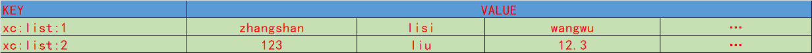

## List 类型

redis中的List类型与python中的list是一个集合双向链表一样，
可以正向检索和反向检索，通常用来存储有序的数据:点赞，评论，名次...

### 数据特点

- 有序
- 元素可以重复
- 插入删除快
- 查询数据一般(线性查询)

### 数据结构



### 常用的操作
- LPUSH 向队指定key值的队列左侧放一个或者多个元素
```redis

 LPUSH key value [value ...]
 summary: Prepend one or multiple values to a list

 -- 向一个列表中添加多个值从左边添加
 127.0.0.1:6379> lpush xc:list:1 name age 123 123.123
 (integer) 4
-- 查询到
 127.0.0.1:6379> lrange xc:list:1 0 -1
 1) "123.123"
 2) "123"
 3) "age"
 4) "name"
```
- RPUSH 向队指定key值的队列右侧放一个或者多个元素
```redis
 RPUSH key value [value ...]
 summary: Append one or multiple values to a list

 -- 向列表的右侧添加数据 返回数据的长度
 127.0.0.1:6379> rpush xc:list:1 1 2 3 4 5
 (integer) 9
```
- LPOP 从队指定key值的队列左侧取出一个元素
```redis
  LPOP key
 summary: Remove and get the first element in a list

 -- 从队列的左侧移除一个元素并返回
 127.0.0.1:6379> lpop xc:list:1
 "123.123" 
 -- 队列的第一个数据
```
- RPOP 从队指定key值的队列右侧取出一个元素
```redis
  RPOP key
 summary: Remove and get the last element in a list

 -- 从队列的右侧移除一个元素并返回
 127.0.0.1:6379> rpop xc:list:1
 "5"
```
- LRANGE 获取指定key值的队列中指定区间的元素
```redis
 LRANGE key start stop
 summary: Get a range of elements from a list
 -- 获取队列的指定区间的数据
 127.0.0.1:6379> lrange xc:list:1 0 -1
 1) "123"
 2) "age"
 3) "name"
 4) "1"
 5) "2"
 6) "3"
 7) "4"
 
```
- LINDEX 获取指定key值的队列中指定索引的元素
```redis
  LINDEX key index
 summary: Get an element from a list by its index

 -- 获取队列中指定位置的元素 存在的话返回数据，不存在返回(nil)
 127.0.0.1:6379> lindex xc:list:1 1
 "age"
 127.0.0.1:6379> lindex xc:list:1 100
 (nil)
```
- LINSERT 在指定key值的队列中指定元素前面/后面插入一条数据
```redis
 LINSERT key BEFORE|AFTER pivot value
 summary: Insert an element before or after another element in a list
 
 -- 在队列中指定位置插入数据 BEFORE|AFTER
 127.0.0.1:6379> linsert xc:list:1 BEFORE age before_age
 (integer) 8
 127.0.0.1:6379> lrange xc:list:1 0 -1
 1) "123"
 2) "before_age"
 3) "age"
 4) "name"
 5) "1"
 6) "2"
 7) "3"
 8) "4"
```
- LREM 删除指定key值的队列中指定数量的元素
```redis
 LREM key count value
 summary: Remove elements from a list

 -- 删除队列中指定数量,指定值的元素 有删除指定数量，没有返回0
 1127.0.0.1:6379> lrem xc:list:1 12 1
 (integer) 6
```
- LTRIM 截取指定key值的队列中指定区间的元素 只保留截取的部分
```redis
  LTRIM key start stop
 summary: Trim a list to the specified range

 -- 截取队列的指定区间的数据
 127.0.0.1:6379> lrange xc:list:1 0 -1
 1) "1"
 2) "2"
 3) "3"
 4) "4"
 5) "5"
 6) "6"
 7) "7"
 8) "8"
 9) "9"


 127.0.0.1:6379> ltrim xc:list:1 2 5
 OK
 
 
 127.0.0.1:6379> lrange xc:list:1 0 -1
 1) "3"
 2) "4"
 3) "5"
 4) "6"
```
- LLEN 获取指定key值的队列的长度
```redis
 LLEN key
 summary: Get the length of a list

 -- 返回list的长度
 127.0.0.1:6379> llen xc:list:1
 (integer) 4
```
- LSET 改变指定key值的队列中指定索引位置的元素
```redis
  LSET key index value
 summary: Set the value of an element in a list by its index

 -- 修改队列中指定位置的元素 下表从0 开始
 127.0.0.1:6379> lset xc:list:1 2 999
 OK

 127.0.0.1:6379> lrange xc:list:1 0 -1
 1) "3"
 2) "4"
 3) "999"
 4) "6"
```
- RPOPLPUSH移除一个队列中的最右边元素，并将它放在另一个list最左边
```redis

 RPOPLPUSH source destination
 summary: Remove the last element in a list, prepend it to another list and return it

 -- 移除list1右侧侧移除一个元素 并且加到list2 的左侧

 127.0.0.1:6379> lrange xc:list:2 0 -1
 1) "999"
 127.0.0.1:6379> lrange xc:list:1 0 -1
 1) "3"
 2) "4"
 3) "999"
 4) "6"
 ----------------------
 127.0.0.1:6379> rpoplpush xc:list:1 xc:list:2
 "6"
 127.0.0.1:6379> rpoplpush xc:list:1 xc:list:2
 "999"
 127.0.0.1:6379> rpoplpush xc:list:1 xc:list:2
 "4"
 ------------------
 127.0.0.1:6379> lrange xc:list:2 0 -1
 1) "4"
 2) "999"
 3) "6"
 4) "999"
 127.0.0.1:6379> lrange xc:list:1 0 -1
 1) "3"
```

- RPUSHX 添加一个元素到一个列表中，如果这个列表存在，
```redis
 RPUSHX key value
 summary: Append a value to a list, only if the list exists
 -- 添加一个元素到一个列表中，如果这个列表存在 存在：添加1 不存在:返回0
 127.0.0.1:6379> rpush xc:list:1 888
 (integer) 2
 
```
- BLPOP
```redis
 BLPOP key [key ...] timeout
 summary: Remove and get the first element in a list, or block until one is available
 -- 阻塞获取队列的左侧数据
 127.0.0.1:6379> brpop xc:list:1 10
 1) "xc:list:1"
```
- BRPOP
```redis
 BRPOP key [key ...] timeout
 summary: Remove and get the last element in a list, or block until one is available
 -- 阻塞获取队列的右侧数据
 127.0.0.1:6379> brpop xc:list:1 10
 1) "xc:list:1"
```