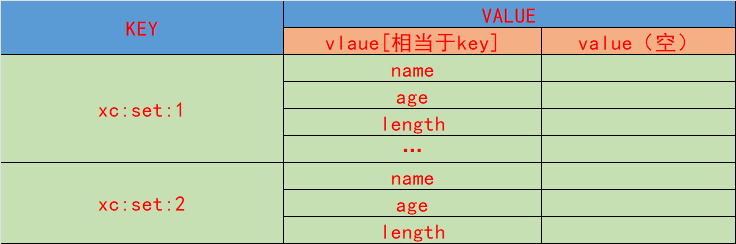

## Set 
集合相当于， 每个key-value(value 只有field 没有值的hash)，保证每个filed只有一个，
同时也雷士2 list 只不过内部的元素不重复

- 无序
- 不重复
- 查找快 hash算法查找
- 支持交集，并集，差集等功能
## 数据的结构




## 常用的命令
- SADD 像一个set类型的key值的集合中添加元素
```redis
 SADD key value1 value2 value3
 summary: Add one or more members to a set
 
 -- 向一个set中添加元素 把并返回添加成功的元素个数
 127.0.0.1:6379> SADD set1 A B C D E F G H I J Q L M N
 (integer) 14
 127.0.0.1:6379> SADD set2 D I C F 1 2 3 4 5
 (integer) 9
```
- SREM 移除set中指定的元素
```redis
 SREM key member1 [member2]
 summary: Remove one or more members from a set
 -- 移除set中指定的元素
 127.0.0.1:6379> srem set1 A
 (integer) 1
 
```
- SCARD 获取集合的元素个数
```redis
 SCARD key
 summary: Get the number of members in a set
 
 -- 获取集合的元素个数 返回集合元素的个数
 127.0.0.1:6379> scard set1
 (integer) 13
```
- SISMEMBER 判断元素是否在集合中
```redis
 SISMEMBER key member
 summary: Determine if a given value is a member of a set
 -- 判断元素是否在集合中 1 在 0 不在
 127.0.0.1:6379> sismember set1 A
 (integer) 0
```
- SMEMBERS 获取集合中所有的元素

```redis
 SMEMBERS key
 summary: Get all the members in a set
 -- 获取集合中所有的元素
 127.0.0.1:6379> smembers set1
 1) "D"
 2) "L"
 3) "B"
 4) "C"
 5) "J"
 6) "N"
 7) "G"
 8) "I"
 9) "F"
10) "Q"
11) "M"
12) "H"
13) "E"
```
- SPOP 随机返回并移除一个元素
```redis
 SPOP key
 summary: Remove and return a random member from a set
 -- 随机返回并移除一个元素 随机移除 并返回这个元素
 127.0.0.1:6379> spop set1
 "F"
```
- SRANDMEMBER 随机返回指定个数的元素 但是不移除
```redis
 SRANDMEMBER key [count]
 summary: Get one or multiple random members from a set
 -- 随机返回指定个数的元素 但是不移除
 127.0.0.1:6379> srandmember set1 3
 1) "B"
 2) "E"
 3) "J"
```
- SMOVE 移动元素 
```redis
 SMOVE source destination member
 summary: Move a member from one set to another
 -- 把某个元素从set1移动到set2
 127.0.0.1:6379> smove set1 set2 G
 (integer) 1
```
- SINTER 获取多个集合的交集
```redis
 SINTER key [key ...]
 summary: Get the intersection between one or more sets
 -- 获取多个集合的交集  返回数据不存储
 127.0.0.1:6379> sinter set1 set2
 127.0.0.1:6379> sinter set1 set2
 1) "D"
 2) "C"
 3) "I"
```
- SUNION 获取多个集合的并集
```redis
 SUNION key [key ...]
 summary: Get the union between one or more sets
 -- 获取多个集合的并集  返回数据不存储
 127.0.0.1:6379> sunion set1 set2
 127.0.0.1:6379> sunion set1 set2
 1) "3"
 2) "J"
 3) "C"
 4) "N"
 5) "I"
 6) "F"
 7) "Q"
 8) "1"
 9) "2"
10) "4"
11) "H"
12) "M"
13) "E"
14) "D"
15) "L"
16) "5"
17) "B"
18) "G"
```
- 
- SDIFF 获取多个集合的差集
```redis
 SDIFF key [key ...]
 summary: Get the difference between one or more sets
 -- 获取多个集合的差集  返回数据不存储

 127.0.0.1:6379> sdiff set1 set2
 -- set1 -set2
 1) "L"
 2) "B"
 3) "Q"
 4) "J"
 5) "H"
 6) "M"
 7) "N"
 8) "E"
```
- SINTERSTORE 获取多个集合的交集并保存到一个新的集合中
```redis
 SINTERSTORE destination key [key ...]
 summary: Get the intersection between one or more sets and store the result in a new set
 -- 获取多个集合的交集并保存到一个新的集合中
 127.0.0.1:6379> sinterstore inter-set1-set2 set1 set2
 (integer) 3
 127.0.0.1:6379> smembers inter-set1-set2
 1) "I"
 2) "D"
 3) "C"
```
- SUNIONSTORE 获取多个集合的并集并保存到一个新的集合中
```redis
 SUNIONSTORE destination key [key ...]
 summary: Get the union of one or more sets and store the result in a new set
 -- 获取多个集合的并集并保存到一个新的集合中
127.0.0.1:6379> smembers union-set1-set2
 1) "B"
 2) "L"
 3) "3"
 4) "J"
 5) "C"
 6) "N"
 7) "G"
 8) "I"
 9) "F"
10) "Q"
11) "1"
12) "H"
13) "M"
14) "E"
15) "D"
16) "2"
17) "4"
18) "5"
```
- SDIFFSTORE 获取多个集合的差集并保存到一个新的集合中
```redis
 SDIFFSTORE destination key [key ...]
 summary: Get the difference between one or more sets and store the result in a new set
 -- 获取多个集合的差集并保存到一个新的集合中
 127.0.0.1:6379> sdiffstore diff-set1-set2 set1 set2
(integer) 8
127.0.0.1:6379> smembers diff-set1-set2
1) "L"
2) "B"
3) "Q"
4) "J"
5) "H"
6) "M"
7) "N"
8) "E"
```


