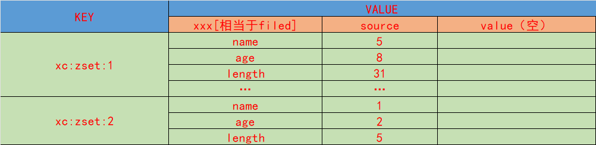

## SortedSet

是一个Set的扩展，添加了一个source 字段，Sortedset可以根据这个字段遂于无序的set，进行排序
是从而实现 sorted的有序的方式
底层是 跳表+hash表

- 可以排序
- 不重复
- 查询速度快

## 数据的结构



## 常用的操作

- ZADD 添加一个或多个数据到sorted_set中,或者更新一个有一个已经存在的sorted_set

```redis
 ZADD key score member [score member ...]
 -- 
 127.0.0.1:6379> ZADD zset1 87 ls 76 ww 97 lh 23 ml 64 zs
 (integer) 5
```

- ZREM 删除一个或者多个数据

```redis
  ZREM key member [member ...]
 summary: Remove one or more members from a sorted set

 -- 删除一个或者多个元素
 127.0.0.1:6379> zrem zset1 ls lh
 (integer) 2
```

- ZSOURE 获取sorted_set的score字段

```redis
    
 ZSCORE key member
 summary: Get the score associated with the specified member in a sorted set
 -- 获取指定元素score
 127.0.0.1:6379> zscore zset1 zo
 (nil)
 127.0.0.1:6379> zscore zset1 zs
 "64"
```

- ZRANGE 获取sorted_set中展示

```redis
ZRANGE key start stop [WITHSCORES]
summary: Return a range of members in a sorted set, by index
-- 获取指定区间的元素 返回按照分数排序后的顺序
127.0.0.1:6379> zrange zset1 0 -1 WITHSCORES
1) "ml"
2) "23"
3) "zs"
4) "64"
5) "ww"
6) "76"

127.0.0.1:6379> zrange zset1 0 -1
1) "ml"
2) "zs"
3) "ww"

```

- ZRANK 返回指定元素在zset中的排名

```redis
ZRANK key member
summary: Return the rank of member in the sorted set stored at key, with scores ordered from low to high.

-- 获取指定元素排名 0 开始
127.0.0.1:6379> zrank zset1 zs
(integer) 1
```

- ZCARD 获取sorted_set中元素的个数

```redis
    ZCARD key
 summary: Return the sorted set cardinality (number of elements) of the sorted set stored at key.
 -- 获取sorted_set中元素的个数
 127.0.0.1:6379> zcard zset1
 (integer) 3
```

- ZCOUNT 获取sorted_set中score指定区间的元素个数 [min max]
```redis
ZCOUNT key min max
  summary: Count the members in a sorted set with scores within the given values
  -- 获取指定score区间的元素个数
  127.0.0.1:6379> zrange zset1 0 -1 WITHSCORES
1) "ml"
2) "23"
3) "zs"
4) "64"
5) "ww"
6) "76"

127.0.0.1:6379> zcount zset1 0 70
(integer) 2
```
- ZINCRBY 让zset中的指定元素的score 增长指定大小
```redis
ZINCRBY key increment member
summary: Increment the score of member in a sorted set at key by increment
-- 让zset中的指定元素的score 增长指定大小
127.0.0.1:6379> zincrby zset1 9 ml
"32"
23 -> 32
```
- ZRANGEBYSCORE 获取sorted_set中指定score区间的元素
- 