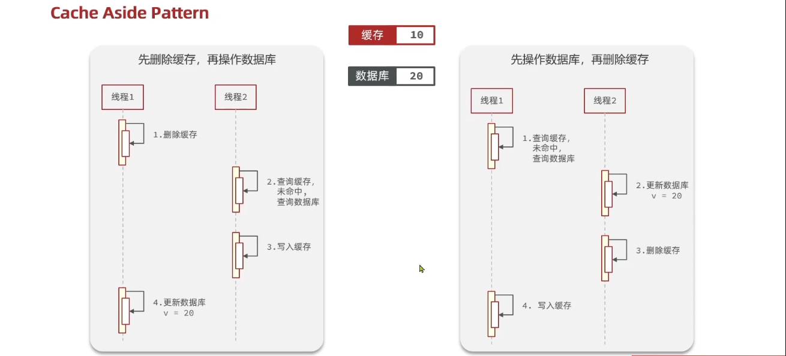

## 什么是缓存？

缓存（Cache）是一种临时存储机制，将高频访问的数据存放在高速存储介质中（如内存），避免每次都去访问低速存储（如磁盘/数据库），从而提升访问速度。

在 Web 开发中，Redis 作为缓存层，介于应用程序和数据库之间：

```
客户端 -> 应用程序 -> Redis缓存 -> 数据库
                       ↓ 命中直接返回
```

## 缓存有什么用？

- **提升性能**：内存读取速度远快于数据库磁盘 IO
- **降低数据库压力**：热点数据从缓存获取，减少数据库查询次数
- **提高并发能力**：Redis 单机支持 10万+ QPS，远超数据库承载能力
- **提升用户体验**：响应时间从秒级降到毫秒级

---

## 简单的缓存架构

```
         ┌──────────┐
         │  客户端   │
         └────┬─────┘
              │
         ┌────▼─────┐
         │ 应用服务  │
         └────┬─────┘
              │
     ┌────────▼────────┐
     │   Redis 缓存     │  ← 热点数据全部在内存中
     └────────┬────────┘
              │ 缓存未命中时回源
     ┌────────▼────────┐
     │   数据库(MySQL)  │  ← 数据持久化存储
     └─────────────────┘
```

代码示例（对应 `redis_code/009_redis_flask_project.py` 的 `/api/user/cache` 接口）：

```python
@app.route("/api/user/cache", methods=["POST"])
def user_data():
    data = request.get_json()
    id = data.get("id")

    allData = [{"id": "001", "name": "张三", "age": 24}, ...]

    # 1. 先查询缓存中是否有数据
    with RedisConn() as r:
        if r.exists(f"user:cache:{id}"):
            data = r.hgetall(f"user:cache:{id}")
            return jsonify({"code": 200, "msg": "缓存命中", "data": data})

    # 2. 缓存未命中，查数据库
    for data in allData:
        if data["id"] == id:
            with RedisConn() as r:
                r.hset(f"user:cache:{id}", mapping=data)
            return jsonify({"code": 200, "msg": "数据库查询并缓存", "data": data})

    # 3. 数据库也没有
    return jsonify({"code": 404, "msg": "数据不存在"})
```

---

## 缓存更新策略？

Redis 提供了三种缓存更新策略：

### 1. 内存淘汰策略

当 Redis 内存不足时，自动淘汰部分 key 来释放空间。通过 `maxmemory-policy` 配置：

| 策略 | 说明 | 适用场景 |
|------|------|---------|
| `noeviction` | 内存满时拒绝写入（默认） | 不允许数据丢失 |
| `allkeys-lru` | 从所有 key 中淘汰最近最少使用的 | 通用缓存场景（推荐） |
| `volatile-lru` | 从设置了过期时间的 key 中淘汰最近最少使用的 | 部分 key 需要持久 |
| `allkeys-random` | 随机淘汰 | 所有 key 优先级相同 |
| `volatile-random` | 从设置了过期时间的 key 中随机淘汰 | - |
| `volatile-ttl` | 淘汰剩余存活时间最短的 | 优先清理即将过期的 |

在 `redis.conf` 中配置：
```
maxmemory 1gb
maxmemory-policy allkeys-lru
```

### 2. 超时剔除

给 key 设置过期时间（TTL），到期后自动删除。

```python
# 设置 key 并指定过期时间（秒）
r.setex("user:001", 3600, "张三")

# 对已有 key 设置过期时间
r.expire("user:001", 3600)

# 查看剩余过期时间
r.ttl("user:001")   # 返回秒数，-1表示永久，-2表示不存在
```

过期时间建议：

| 场景 | 建议过期时间 |
|------|------------|
| 验证码 | 5 分钟 |
| 登录 token | 2 小时 |
| 热点数据缓存 | 30 分钟 ~ 2 小时 |
| 防刷限流标记 | 60 秒 |

### 3. 主动更新

由应用程序在修改数据库时，主动同步更新或删除缓存。

#### 更新库的同时更新缓存（主要方式）

主要有三种操作方式：

#### (1) 删除缓存还是更新缓存？

**推荐：删除缓存**

| 方式 | 优点 | 缺点 |
|------|------|------|
| 更新缓存 | 缓存始终是最新的 | 并发写时容易出现数据不一致；写多读少时浪费性能（更新了但没人读） |
| **删除缓存** | 实现简单；下次读取自动加载最新数据 | 短暂存在缓存未命中的情况 |

举例说明为什么推荐删除：
```
线程A更新 name 为 "李四"
  - 方式一（更新缓存）：如果 name 没人读，这次更新是浪费的
  - 方式二（删除缓存）：下次有人读时才从数据库加载最新值，精准有效
```

#### (2) 如何保证缓存与数据库之间操作的事务性？

两种常见方案：


**方案一：先更新数据库，再删除缓存（推荐）**

```python
# 事务或编程式保证
def update_user(user_id, name):
    # 1. 更新数据库
    db.execute("UPDATE user SET name=%s WHERE id=%s", (name, user_id))
    # 2. 删除缓存
    r.delete(f"user:{user_id}")
```

**方案二：延迟双删**

```python
import time

def update_user(user_id, name):
    # 1. 先删缓存
    r.delete(f"user:{user_id}")
    # 2. 更新数据库
    db.execute("UPDATE user SET name=%s WHERE id=%s", (name, user_id))
    # 3. 延迟一小段时间后再次删除（兜底）
    time.sleep(0.5)
    r.delete(f"user:{user_id}")
```

延迟双删解决的问题：在步骤2和3之间，可能有其他线程读到了旧数据库数据并回填了缓存，第二次删除可以清理这个脏数据。

#### (3) 先操作缓存还是先操作数据库？

**推荐：先操作数据库，再删除缓存**

```
正确流程：
  更新数据库 -> 删除缓存

为什么？
  如果先删缓存再更新数据库：
    线程A: 删除缓存
    线程B: 读缓存(未命中) -> 读数据库(读到旧数据) -> 写入缓存（脏数据！）
    线程A: 更新数据库
    结果：缓存中是旧数据，数据库是新数据，数据不一致

  如果先更新数据库再删缓存：
    线程A: 更新数据库
    线程A: 删除缓存
    线程B: 读缓存(未命中) -> 读数据库(新数据) -> 写入缓存
    结果：数据一致（即使 A 删除前 B 读到了旧数据，窗口也很小）
```

#### 2. 缓存和数据库合为一个服务，自动维护

类似 ORM 框架的方式，在数据访问层自动处理缓存逻辑，业务代码不感知缓存存在。例如 Hibernate 的二级缓存。

#### 3. 写回调方式（Write-Behind）

用户只操作缓存，由后台线程异步将缓存数据批量写入数据库。

```
客户端 -> 写入Redis缓存 -> 立即返回
                        -> 后台线程定时批量写入数据库
```

优点：写入性能极高
缺点：Redis 宕机可能丢失未同步的数据

---

## 缓存常见三大问题

### 1. 缓存穿透

**问题**：查询一个数据库中根本不存在的数据（如 id=-1），缓存中也不会有，每次请求都穿透缓存直接打到数据库。恶意攻击者可以用大量不存在的 key 轰炸数据库。

**解决方案**：

**方案一：缓存空值**

```python
def get_user(user_id):
    with RedisConn() as r:
        cached = r.get(f"user:{user_id}")
        # 缓存了空值标记，数据库查过确实不存在
        if cached == "NULL":
            return None
        # 缓存命中正常数据
        if cached:
            return cached

    # 缓存未命中，查数据库
    data = db.query_user(user_id)
    if data is None:
        # 数据库也没有，缓存空值，过期时间短一些
        r.setex(f"user:{user_id}", 60, "NULL")
        return None

    r.setex(f"user:{user_id}", 3600, data)
    return data
```

**方案二：布隆过滤器**

在 Redis 前加一层布隆过滤器，判断 key 是否可能存在：

```
请求 -> 布隆过滤器
         ├─ 不存在 -> 直接返回（数据库不可能有这个key）
         └─ 可能存在 -> 正常查缓存 -> 查数据库
```

布隆过滤器特点：判断"不存在"是准确的，判断"可能存在"有小概率误判。

### 2. 缓存击穿

**问题**：某个热点 key（如秒杀商品）过期的瞬间，大量并发请求同时涌入，全部打到数据库，导致数据库压力骤增。

**解决方案**：

**方案一：加互斥锁**

```python
def get_product(product_id):
    with RedisConn() as r:
        data = r.get(f"product:{product_id}")
        if data:
            return data

        # 尝试获取分布式锁
        lock_key = f"lock:product:{product_id}"
        if r.set(lock_key, "1", nx=True, ex=10):
            try:
                # 获取锁成功，查数据库
                data = db.query_product(product_id)
                if data:
                    r.setex(f"product:{product_id}", 3600, data)
                return data
            finally:
                r.delete(lock_key)
        else:
            # 获取锁失败，等待其他线程加载完成后重试
            time.sleep(0.1)
            return r.get(f"product:{product_id}")
```

**方案二：热点 key 永不过期 + 后台定时更新**

```python
# 设置时不加过期时间
r.set(f"product:{product_id}", data)

# 后台定时任务每30分钟更新一次
def refresh_cache():
    products = db.query_hot_products()
    for p in products:
        r.set(f"product:{p['id']}", p)
```

### 3. 缓存雪崩

**问题**：大量 key 在同一时间过期，或 Redis 实例宕机，导致大量请求同时打到数据库。

**解决方案**：

**方案一：随机过期时间**

```python
import random
base_ttl = 3600
# 在基础过期时间上加 0~300 秒随机值
actual_ttl = base_ttl + random.randint(0, 300)
r.setex(f"user:{user_id}", actual_ttl, data)
```

**方案二：Redis 高可用**

- 主从复制 + 哨兵：主节点宕机自动切换从节点
- Redis Cluster：多节点分片，单个节点故障不影响整体

**方案三：多级缓存**

```
请求 -> 本地缓存(进程内) -> Redis缓存 -> 数据库
         Caffeine/Guava        Redis       MySQL
```

即使 Redis 宕机，本地缓存也能挡一部分请求。

**方案四：限流降级**

在应用层加限流，保护数据库不被打垮。参考 `redis_code/009_redis_flask_project.py` 中的 `@rate_limit` 装饰器。

---

## 总结

| 问题 | 原因 | 解决方案 |
|------|------|---------|
| 缓存穿透 | 查不存在的数据 | 缓存空值 / 布隆过滤器 |
| 缓存击穿 | 热点 key 过期瞬间并发 | 互斥锁 / 永不过期+后台更新 |
| 缓存雪崩 | 大量 key 同时过期 / Redis 宕机 | 随机过期时间 / Redis 高可用 / 多级缓存 / 限流降级 |
| 数据不一致 | 缓存和数据库操作非原子 | 先更新 DB 再删缓存 / 延迟双删 |
| 并发写入 | 非原子的读-改-写 | Redis 原子操作（INCR/DECR） |
