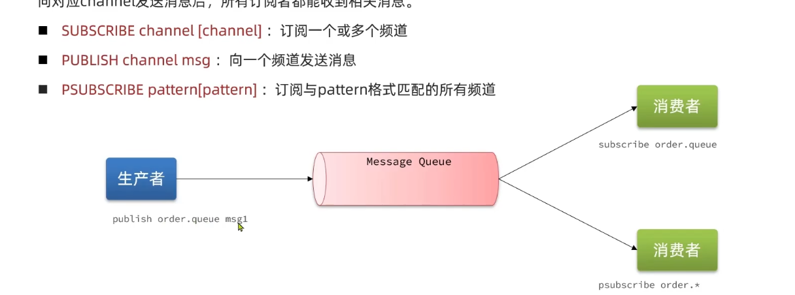
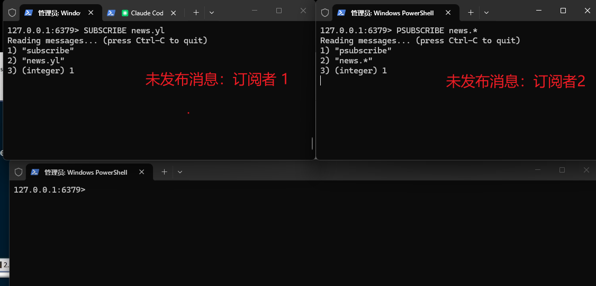
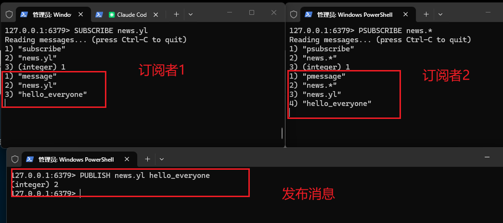
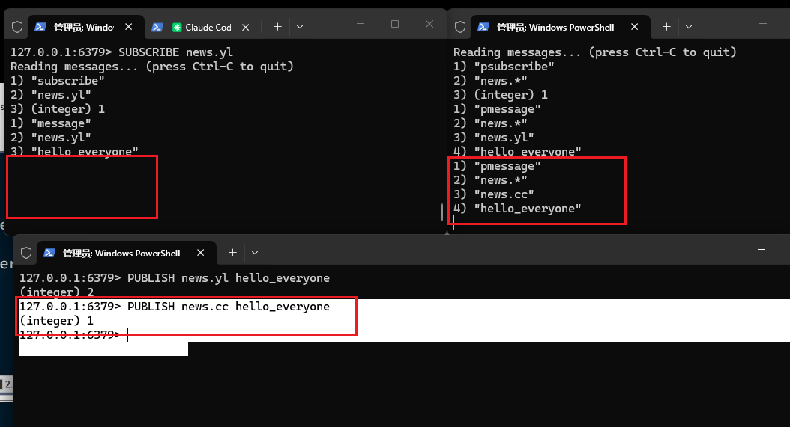
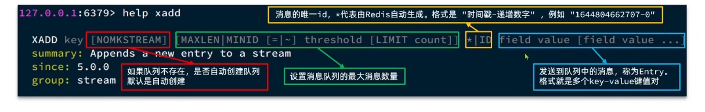

## Message Queue

消息队列：存放消息的队列（只能从一端进入另一端出）
使用消息队列的时候，一般有三个校色

- 生产者：生产消息的校色，将生产的消息放进消息队列中
- 消息队列：存储和管理消息，是生产者和消费者的中间代理
- 消费者：负责消费消息，从消息队列中去除消息，进行消费
  

### 基于 Redis的List结构的消息队列

特点：

- 【LPUSH RPOP】/【RPUSH lPOP】实现一段添加数据另一端移除移除数据 保证入口和出口相反
- 【BLPOP RPUSH】/ 【BRPOP LPUSH】 实现阻塞某个队列，指导有数据，然后就消费处理
    - 【优点】不受限服务器的内存限制
    - 【优点】数据持久化，数据安全有保障
    - 【优点】满足消息的有序性，顺序被消费
    - 【缺点】消息会丢失(消费者取出了消息但是没有消费/出错了，数据就丢失了)
    - 【缺点】只能支持单个消费者

```redis
PS:
如果不存在msg 或msg这个列表为空
1 使用 BRPOP msg 实现这个队列阻塞
2 等待有数据插入
3 LPUSH msg data 实现向队列中加一个数据
4 同步的因为BRPOP 再实时向列表中哪一个数据 所以数据会被拿出来
5 获取数据


1 =====
127.0.0.1:6379> BRPOP msg 30
.... 等待中

2 ====
127.0.0.1:6379> lpush msg 1 2 3 4
(integer) 4

3 =====
127.0.0.1:6379> BRPOP msg 30
1) "msg"
2) "1"
(16.96s)
```

### 基于Redis的PubSub的方式的消息队列

PubSub(发布订阅)的模式，是一种消息通信模式，允许多个订阅者订阅同一个频道，
当有消息发布到该频道时，所有订阅者都会收到该消息。
ps： 我们提前订阅某一期的报纸，等到这一期报纸印刷完成好，按照我们的订阅给我们发送报纸
操作方式

- SUBSCRIBE channel [channel ...] 订阅一个频道或者多个频道
- PUBLISH channel msg : 向某个频道发送消息【订阅这个频道的订阅者都能收到】
- PSUBSCRIBE pattern [pattern ...] 不写完整的频道名称，监听正则匹配的频道名
  
  - 【优点】支持多生产者多消费者，发布订阅模式
  - 【缺点】不支持数据持久化
  - 【缺点】无法避免消息丢失
  - 【缺点】消息堆积的数据有限，超时数据丢失

发布和订阅的流程
订阅：SUBSCRIBE news.yl ， PSUBSCRIBE news.*

发布消息   PUBLISH news.yl hello_everyone

PUBLISH news.cc hello_everyone


### 基于Stream的消息队列
Stream 是一种数据类型，支持数据的持久化存储，可以实现完善的消息队列

- 数据结构和使用方式

- XADD 添加一个消息体到 stream中
```redis
  XADD key ID field string [field string ...]
 summary: Appends a new entry to a stream

 -- 添加一个消息体到 stream中 返回这个消息的id
 127.0.0.1:6379> xadd stream * name tom age 12 sex male
 "1778940733272-0"
```
- XLEN 当前消息stream的消息数量
```redis
 XLEN key
 summary: Return the number of entires in a stream
 -- 获取当前消息stream的消息数量
 127.0.0.1:6379> xlen stream
 (integer) 2
```
- XRANGE 获取指定范围的消息
```redis
  XRANGE key start end [COUNT count]
 summary: Return a range of elements in a stream, with IDs matching the specified IDs interval
 -- 获取指定范围消息
 127.0.0.1:6379> xrange stream - +
1) 1) "1778940733272-0"
   2) 1) "name"
      2) "tom"
      3) "age"
      4) "12"
      5) "sex"
      6) "male"
2) 1) "1778940777091-0"
   2) 1) "name"
      2) "tom1"
      3) "age"
      4) "121"
      5) "sex"
      6) "male1"
 
```
- XREVRANGE 获取指定范围消息，但是是倒序的
```redis
 XREVRANGE key start end [COUNT count]
 summary: Return a range of elements in a stream, with IDs matching the specified IDs interval in reverse order (from the highest to the lowest IDs)
 -- 获取指定范围消息，但是是倒序的
 127.0.0.1:6379> xrevrange stream + -
1) 1) "1778940777091-0"
   2) 1) "name"
      2) "tom1"
      3) "age"
      4) "121"
      5) "sex"
      6) "male1"
2) 1) "1778940733272-0"
   2) 1) "name"
      2) "tom"
      3) "age"
      4) "12"
      5) "sex"
      6) "male"
```
- XREAD 获取指定时间点之后的消息
```redis 
 XREAD [COUNT count] [BLOCK milliseconds] STREAMS key [key ...] ID [ID ...]
  summary: Return never seen elements in multiple streams, with IDs greater than the ones reported by the caller for each stream. Can block.
  -- 获返回指定数量的比你指定的id更大的数据  返回比1778940777090-0更大的 5 条数据 但是只有一条
127.0.0.1:6379> XREAD COUNT 5 STREAMS stream 1778940777090-0
1) 1) "stream"
   2) 1) 1) "1778940777091-0"
         2) 1) "name"
            2) "tom1"
            3) "age"
            4) "121"
            5) "sex"
            6) "male1"
```
- XGROUP 创建消费组

```redis
 XGROUP CREATE key groupname id|MKSTREAM [READCOUNT count]
 summary: Create a consumer group

 -- 为 stream 创建一个消费组，从头开始消费
 127.0.0.1:6379> XGROUP CREATE stream group1 0
 OK

 -- 如果 stream 不存在，可以用 MKSTREAM 自动创建
 127.0.0.1:6379> XGROUP CREATE stream2 group1 0 MKSTREAM
 OK

 -- 从最新消息开始消费（只消费新来的消息，不消费历史消息）
 127.0.0.1:6379> XGROUP CREATE stream group2 $
 OK
```

- XREADGROUP 消费组消费消息，并且将消息标记为已消费

```redis
 XREADGROUP GROUP groupname consumer [COUNT count] [BLOCK milliseconds] [NOACK] STREAMS key [key ...] ID [ID ...]
 summary: Return new messages from a stream using a consumer group, and access the history of the pending entries for a consumer

 -- 使用 > 读取未被消费组消费过的新消息
 127.0.0.1:6379> XREADGROUP GROUP group1 consumer1 COUNT 2 STREAMS stream >
 1) 1) "stream"
   2) 1) 1) "1778940733272-0"
         2) 1) "name"
            2) "tom"
            3) "age"
            4) "12"
            5) "sex"
            6) "male"
      2) 1) "1778940777091-0"
         2) 1) "name"
            2) "tom1"
            3) "age"
            4) "121"
            5) "sex"
            6) "male1"

 -- 使用 0 读取已消费但未确认的消息（pending 消息）
 127.0.0.1:6379> XREADGROUP GROUP group1 consumer1 STREAMS stream 0

 -- 阻塞读取：如果没有新消息则阻塞等待，最多等 5000 毫秒
 127.0.0.1:6379> XREADGROUP GROUP group1 consumer1 BLOCK 5000 COUNT 1 STREAMS stream >
```

- XACK 确认指定的消息已经处理完成

```redis
 XACK key groupname ID [ID ...]
 summary: Marks a pending message as correctly processed

 -- 确认消息已被消费，从 pending 列表中移除
 127.0.0.1:6379> XACK stream group1 1778940733272-0
 (integer) 1
 -- 返回 1 表示确认成功，0 表示消息不存在或已被确认
```

- XDEL 删除指定的消息

```redis
 XDEL key ID [ID ...]
 summary: Removes the specified entries from a stream

 -- 删除指定 ID 的消息
 127.0.0.1:6379> XDEL stream 1778940733272-0
 (integer) 1
 -- 返回实际删除的消息数量
```

- XPENDING 获取指定消费组中，未处理的消息概览

```redis
 XPENDING key groupname [[IDLE min-idle-time] start end count [consumer]]
 summary: Return information and entries from a stream consumer group pending entries list

 -- 简要查看 pending 信息（总数量、最小/最大ID、消费者列表）
 127.0.0.1:6379> XPENDING stream group1
 1) (integer) 2                          -- 未确认消息总数
 2) "1778940733272-0"                     -- 最小 pending 消息ID
 3) "1778940777091-0"                     -- 最大 pending 消息ID
 4) 1) 1) "consumer1"                     -- 每个消费者的 pending 数量
      2) "2"

 -- 详细查看 pending 消息列表（指定范围和数量）
 127.0.0.1:6379> XPENDING stream group1 - + 10
 1) 1) "1778940733272-0"                  -- 消息ID
   2) "consumer1"                         -- 消费者名称
   3) (integer) 15000                     -- 从被分配到现在的空闲时间（毫秒）
   4) (integer) 1                         -- 被投递次数
 2) 1) "1778940777091-0"
   2) "consumer1"
   3) (integer) 12000
   4) (integer) 1

 -- 查看空闲时间超过 60000ms 的 pending 消息
 127.0.0.1:6379> XPENDING stream group1 IDLE 60000 - + 10 consumer1
```

- XTRIM 修剪消息流，限制长度

```redis
 XTRIM key MAXLEN|MINID [=|~] threshold [LIMIT count]
 summary: Trims the stream to (approximately if '~' is used) a certain size

 -- 精确裁剪，只保留最新的 1000 条消息
 127.0.0.1:6379> XTRIM stream MAXLEN 1000
 (integer) 5  -- 返回被删除的消息数量

 -- 近似裁剪（~），Redis 会在内部选择合适的节点批量删除，性能更好
 127.0.0.1:6379> XTRIM stream MAXLEN ~ 1000
 (integer) 5

 -- 删除指定 ID 之前的消息（MINID）
 127.0.0.1:6379> XTRIM stream MINID 1778940777091-0
 (integer) 1

 -- XADD 时自动裁剪，保留最新 100 条
 127.0.0.1:6379> XADD stream MAXLEN ~ 100 * name jack age 25
 "1778940800000-0"
```

- XINFO 查看流和消费组的详细信息

```redis
 XINFO STREAM key [FULL [COUNT count]]
 summary: Returns information about a stream

 -- 查看流的基本信息
 127.0.0.1:6379> XINFO STREAM stream
  1) "length"                             -- 流中消息总数
  2) (integer) 5
  3) "radix-tree-keys"                    -- 底层基数树的键数
  4) (integer) 1
  5) "radix-tree-nodes"                   -- 底层基数树的节点数
  6) (integer) 2
  7) "last-generated-id"                  -- 最后生成的消息ID
  8) "1778940777091-0"
  9) "max-deleted-entry-id"               -- 最大已删除消息ID
 10) "0-0"
 11) "entries-added"                      -- 累计添加的消息数
 12) (integer) 5
 13) "groups"                             -- 消费组数量
 14) (integer) 2

 -- 查看消费组信息
 127.0.0.1:6379> XINFO GROUPS stream
 1) 1) "name"                             -- 消费组名称
   2) "group1"
   3) "consumers"                         -- 消费者数量
   4) (integer) 1
   5) "pending"                           -- 未确认消息数
   6) (integer) 2
   7) "last-delivered-id"                 -- 最后投递的消息ID
   8) "1778940777091-0"

 -- 查看消费组中的消费者信息
 127.0.0.1:6379> XINFO CONSUMERS stream group1
 1) 1) "name"                             -- 消费者名称
   2) "consumer1"
   3) "pending"                           -- 该消费者的未确认消息数
   4) (integer) 2
   5) "idle"                              -- 空闲时间（毫秒）
   6) (integer) 30000
```

- XCLAIM 将 pending 消息转交给其他消费者处理

```redis
 XCLAIM key groupname consumer min-idle-time ID [ID ...] [IDLE ms] [TIME ms-Unix-time] [RETRYCOUNT count] [FORCE] [JUSTID] [LASTID id] [IDLE ms] [TIME ms]
 summary: Changes (or acquires) ownership of a message in a consumer group

 -- 将消息转交给 consumer2（消息空闲超过 60000ms 才能被转交）
 127.0.0.1:6379> XCLAIM stream group1 consumer2 60000 1778940733272-0
 1) 1) "1778940733272-0"
   2) 1) "name"
      2) "tom"
      3) "age"
      4) "12"
      5) "sex"
      6) "male"

 -- JUSTID 只返回消息ID，不返回消息内容（节省带宽）
 127.0.0.1:6379> XCLAIM stream group1 consumer2 60000 1778940733272-0 JUSTID
 1) "1778940733272-0"

 -- 强制转交（不检查空闲时间）
 127.0.0.1:6379> XCLAIM stream group1 consumer2 0 1778940733272-0 FORCE
```

---

### 消费组机制详解

Stream 的消费组是区别于 List 和 PubSub 的核心特性：

```
                    ┌─ consumer1 ─> 获取消息1,3,5 ...
                    │
stream ──> group1 ──┼─ consumer2 ─> 获取消息2,4,6 ...
                    │
                    └─ consumer3 ─> 获取消息7,8,9 ...

                    ┌─ consumerA ─> 获取所有消息
                    │
stream ──> group2 ──┴─ consumerB ─> 获取所有消息（不同组独立消费）
```

**消费组的特点**：

- 同一个消费组内，消息只会被一个消费者处理（负载均衡）
- 不同消费组之间，消息可以被每个组的消费者各自处理（广播）
- 消息被消费后不会立即删除，需要 XACK 确认后才算真正消费完成
- 未确认的消息会进入 pending 列表，可以重新投递或转交给其他消费者
- 支持消息持久化，服务重启后消息不丢失

**消息流转流程**：

```
生产者 XADD
   ↓
stream（消息列表）
   ↓
消费组 XREADGROUP
   ↓
pending 列表（等待确认）
   ↓
消费者处理完成，XACK
   ↓
从 pending 列表中移除
```

**处理 pending 超时消息的典型流程**：

```python
# 1. 读取 pending 消息中空闲超过 60 秒的
pending = xpending(stream, group, idle=60000, start="-", end="+", count=10)

# 2. 尝试转交给其他消费者
for msg in pending:
    xclaim(stream, group, new_consumer, 0, msg.id, force=True)

# 3. 或者由原消费者重试处理
```

---

### 三种消息队列方案对比

| 对比项 | List | PubSub | Stream |
|--------|------|--------|--------|
| 持久化 | 是 | 否 | 是 |
| 消息丢失 | 消费取出后丢失 | 实时丢失 | 不丢失（需要ACK确认） |
| 多消费者 | 不支持 | 支持（广播） | 支持（消费组 + 负载均衡） |
| 消息堆积 | 受内存限制 | 受内存限制 | 支持裁剪(MAXLEN) |
| 消息有序性 | 有序 | 无序 | 有序（ID递增） |
| 消息回溯 | 不支持 | 不支持 | 支持（按ID范围查询） |
| 消费确认 | 无 | 无 | 支持（XACK） |
| 消息转交 | 无 | 无 | 支持（XCLAIM） |
| 阻塞读取 | 支持(BRPOP) | 支持(SUBSCRIBE) | 支持(XREAD BLOCK) |
| 适用场景 | 简单队列 | 实时通知广播 | 完善的消息队列（推荐） |