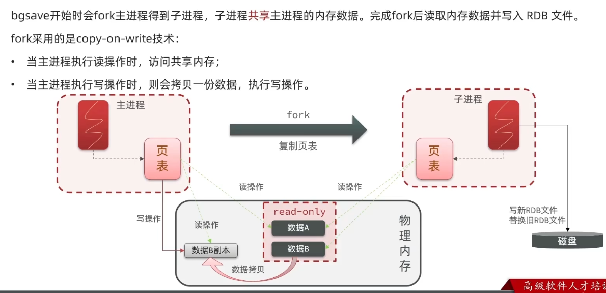
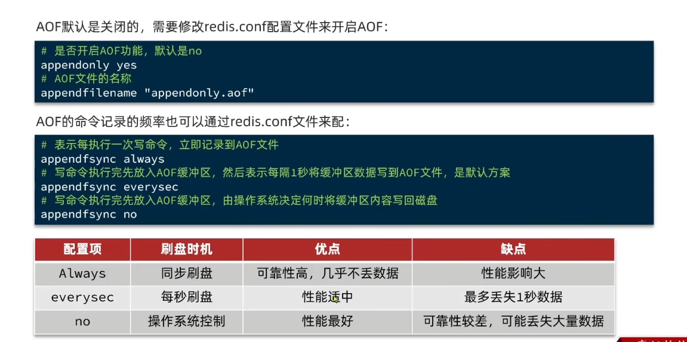
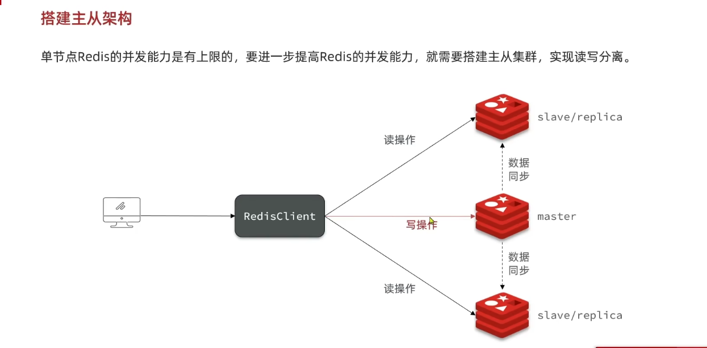
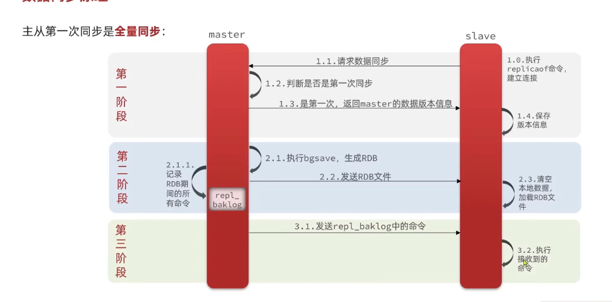
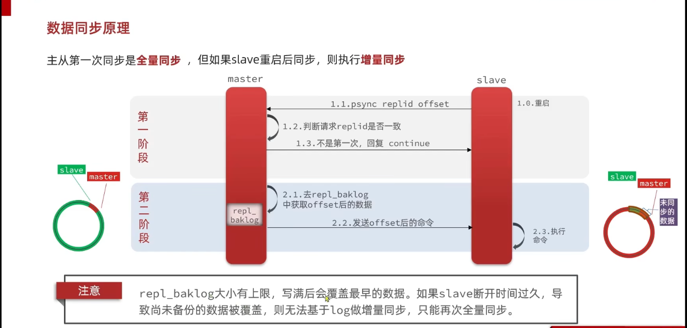

## Redis 分布式存储
redis 多节点，读写分离的部署方式
使用集群的方式来进行Redis数据扩展，相当于加服务器的概念

### Redis单节点的缺点
redis单节点：全局只有全局只有一个Redis服务，无论是读写都会访问这个服务
- 【缺点】数据容易丢失(内存结构)，没有数据备份
- 【缺点】并发能力问题，单节点应对超高的并发的时候还是会有问题容易宕机
- 【缺点】故障恢复的问题，一个服务宕机整个体系都不能用了
- 【缺点】存储能力的问题，单节点存储的数据很难满足海量的数据需求

### Redis的持久化
- RDB
    固定的时间或者主动，"备份"全量的数据，将内存中的数据持久化到磁盘中
    ```redis
        save time  nums（主进程阻塞写入磁盘，不建议使用）将RDB文件写到当前redis运行的目录中
        
        bgsave time  nums（后台写入磁盘）将RDB文件写到当前redis运行的目录中  
  
        -- time s 多少s内 多少次（nums）redis写厨房备份
        redis停机的时候会自动保存一次RDB文件
  ```
    - bgsave 过程：bgsave 开始的时候会fork主进程(这个时候是阻塞的)得到子进程，子进程和组进程共享内存数据。完成fork之后紫禁城会读取内存数据，写入rdb文件，完成备份。
    
- AOF 日志追加文件，只记录redis的写操作，可以看作写操作的日志。
    
    ```redis
        1 记录日志：当redis执行某个命令的时候，自动写一份日志到AOF文件中
        2 恢复数据：想要恢复数据的时候，直接回放(重新执行)一遍AOF文件
  
    ```

### Redis的主从架构
Redis单节点的并发能力有限制，要更提高Redis的鬓发能力，就要搭建主从集群架构【读多写少-读写分离】
 - 主 （一个）：主要扶着写数据，分发各个从节点当前的数据
 - 从 （多个）：只要是读操作，并负责给其他服务提供缓存数据

 - 搭建流程 ： 参考 012_Redis主从架构搭建
#### Redis主从数据同步
 - 全量同步
  
 - 增量同步
    
### Redis哨兵
> 主要是监控redis集群的一个机制
- 监控 ：监控各个节点的状态
- 故障转移：当主节点挂掉的时候，自动将数据转移给从节点，确保数据不丢失。
- 通知：当主节点挂掉的时候，通知各个服务，将数据转移给从节点，确保数据不丢失。
> 哨兵如何判断Redis节点是否下线
- 主观下线：某个哨兵长时间没有收到主节点的ping信息，就认为主节点已经下线了
- 客观下线：半数哨兵都认为主节点已经下线了，就标记下线，开始做故障转移
- 
> 故障转移
- 选取一个从节点作为主节点，并设置 replicaof no one 
    - 1 客观下线
    - 2 排除与主节点断开时间长的节点
    - 3 选择offset偏移量更大的（偏移量越大，数据越新）
    - 4 随机选取一个从节点作为主节点，以id作为优先级
- 让所有的从节点，(广播)都以新的主节点为主（修改其他从节点的配置文件指向主节点）
    - 修改其他从节点的配置文件 replicaof xxx xxx 
- 修改原来主节点的配置文件指向组节点
    - 修改其他从节点的配置文件 replicaof xxx xxx 

### Redis集群分片
