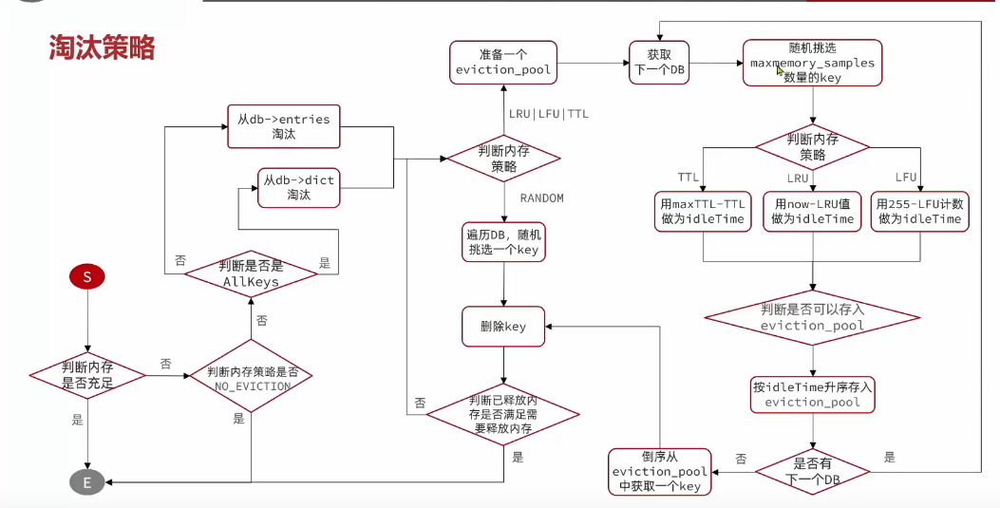

# Redis的原理实现

## Redis的数据结构原理

Redis 的高性能离不开其精心设计的底层数据结构。Redis 对外暴露 String、Hash、List、Set、Sorted Set 五种数据类型，但底层实际使用了多种数据结构来优化不同场景下的性能。

```
对外数据类型            底层数据结构
─────────────────────────────────────
String          ──>    int / embstr / raw (SDS)
Hash (小)       ──>    ziplist
Hash (大)       ──>    hashtable (dict)
List (小)       ──>    ziplist
List (大)       ──>    quicklist (ziplist + 链表)
Set (小)        ──>    intset / ziplist
Set (大)        ──>    hashtable (dict)
Sorted Set (小) ──>    ziplist
Sorted Set (大) ──>    skiplist + hashtable
```

---

### 1 动态字符串 SDS

Redis 没有直接使用 C 语言的原生字符串（`char*`），而是自己设计了 **SDS（Simple Dynamic String）** 作为默认的字符串表示。

#### C 原生字符串 vs SDS

| 对比项 | C 原生字符串 `char*` | SDS |
|--------|---------------------|-----|
| 获取长度 | O(N) 遍历到 `\0` | O(1) 直接读 `len` 字段 |
| 缓冲区溢出 | `strcat` 不检查剩余空间 | 自动扩容，不会溢出 |
| 内存分配 | 每次修改都需要 realloc | 空间预分配 + 惰性释放 |
| 二进制安全 | 不能存含 `\0` 的数据 | 可以存任意二进制数据 |
| 兼容 C 函数 | - | 可以，结尾有 `\0` |

#### SDS 结构

```c
struct sdshdr {
    int len;      // 已使用的长度
    int free;     // 剩余可用空间
    char buf[];   // 实际数据（兼容 C 字符串，末尾有 '\0'）
};
```

```
┌─────────────────────────────────────────┐
│  len=5 | free=3 | buf[] = "hello\0..." │
└─────────────────────────────────────────┘
```

#### 空间预分配策略

- **小于 1MB**：分配 `len` 同等大小的 free 空间。例如 `len=13`，则分配 `13+13+1=27` 字节
- **大于等于 1MB**：固定分配 1MB 的 free 空间

```
修改前: len=13 free=0  buf="hello world\0"
修改后: len=14 free=13 buf="hello world!\0..."   // 多分配了13字节
```

#### 惰性释放

缩短 SDS 时，不立即释放多余空间，而是记录到 `free` 中，等待将来复用。避免频繁的内存分配。

#### 为什么不用 C 字符串？

1. **O(1) 获取长度**：业务中频繁需要获取字符串长度
2. **杜绝缓冲区溢出**：拼接前自动检查空间，不够就扩容
3. **二进制安全**：可以存储图片、序列化对象等二进制数据
4. **减少内存分配次数**：预分配 + 惰性释放

---

### 2 IntSet

IntSet 是 Redis 中 Set 数据类型在元素较少且全为整数时的底层实现。

#### 结构

```c
typedef struct intset {
    uint32_t encoding;  // 编码方式：int16 / int32 / int64
    uint32_t length;    // 元素个数
    int8_t contents[];  // 柔性数组，按 encoding 存储整数（有序）
};
```

```
encoding = int16, length = 4
contents = [1, 5, 12, 50]    // 有序排列，方便二分查找
```

#### 核心特性

- **有序存储**：元素从小到大排列
- **二分查找**：查找时间复杂度 O(log N)
- **自动升级**：当插入的元素超出当前编码范围时，自动升级编码

```
int16 -> int32 -> int64

例如：当前是 int16，存了 [1, 5, 12]
插入 32768（超出 int16 范围）-> 自动升级为 int32
```

#### 优缺点

| 优点 | 缺点 |
|------|------|
| 内存紧凑，节省空间 | 只支持整数元素 |
| 二分查找 O(log N) | 数据量大时编码升级开销大 |
| 有序，方便范围查询 | 不支持动态删除（只标记删除） |

#### 触发条件

当 Set 同时满足以下条件时使用 IntSet：
- 所有元素都是整数值
- 元素数量不超过 `set-max-intset-entries`（默认 512）

---

### 3 Dict

Dict 是 Redis 中 Hash 和 Set 数据类型在数据量较大时的底层实现，本质上是一个 **哈希表**。

#### 结构

```c
// 哈希表
typedef struct dictht {
    dictEntry **table;     // 哈希桶数组
    unsigned long size;    // 桶数量
    unsigned long sizemask; // size - 1，用于计算索引
    unsigned long used;    // 已使用的桶数量
};

// 字典
typedef struct dict {
    dictType *type;        // 类型相关函数
    void *privdata;
    dictht ht[2];          // 两个哈希表：ht[0]正常用，ht[1]扩容时用
    long rehashidx;        // rehash 进度，-1 表示未进行
};
```

```
dict
├── ht[0] ── 正常使用的哈希表
│   ├── table[0] -> entry1 -> entry2 -> ...
│   ├── table[1] -> entry3 -> ...
│   └── ...
└── ht[1] ── rehash 时使用的哈希表（扩容/缩容）
```

#### 哈希冲突

使用 **链地址法** 解决冲突：同一个桶中的多个 entry 组成单向链表。

```
table[0] -> entry_a -> entry_b -> NULL
table[1] -> entry_c -> NULL
table[2] -> entry_d -> entry_e -> entry_f -> NULL
```

#### 渐进式 Rehash

当哈希表的负载因子过高或过低时，需要扩容或缩容。Redis 使用 **渐进式 Rehash**，不会一次性完成，避免阻塞：

1. 分配新的哈希表 `ht[1]`
2. 将 `rehashidx` 设为 0，标记开始 rehash
3. **每次增删改查时**，顺带将 `ht[0]` 中 `rehashidx` 位置的桶迁移到 `ht[1]`，`rehashidx++`
4. 后台定时任务也会批量迁移（每次迁移 100 个桶）
5. 全部迁移完成后，释放 `ht[0]`，将 `ht[1]` 设为 `ht[0]`，新建空的 `ht[1]`

```
rehash 过程中，查询操作会同时查 ht[0] 和 ht[1]
增加操作只写 ht[1]
删除和修改操作同时更新两个表
```

#### 触发扩容的条件

- 服务器没有执行 `BGSAVE` / `BGREWRITEAOF` 时，负载因子 >= 1
- 服务器正在执行 `BGSAVE` / `BGREWRITEAOF` 时，负载因子 >= 5（避免在持久化期间扩容）

---

### 4 ZipList

ZipList 是一种 **紧凑的连续内存数据结构**，在数据量小的时候替代 Dict/Skiplist，大幅节省内存。

#### 结构

```
┌────────┬────────┬────────┬───────┬───────┬───────┬────────┬────────┐
│ zlbytes│ zltail │ zlentry│ entry1│ entry2│ entry3│  ...   │  zlend │
│ (4字节) │ (4字节) │ (2字节) │       │       │       │        │ (1字节) │
└────────┴────────┴────────┴───────┴───────┴───────┴────────┴────────┘
  整体字节数  尾节点偏移  节点数量                              结束标记
```

#### Entry 结构

每个 entry 由三部分组成：

```
┌──────────────┬──────────────┬─────────────┐
│  prevrawlens │   encoding   │    data     │
│  前一个entry  │   编码方式    │   实际数据   │
│  的长度       │              │             │
└──────────────┴──────────────┴─────────────┘
```

- `prevrawlens`：记录前一个 entry 的长度，用于反向遍历
- `encoding`：根据 data 类型和长度选择不同的编码方式，节省空间
- `data`：实际数据

#### 优缺点

| 优点 | 缺点 |
|------|------|
| 连续内存，CPU 缓存友好 | 查找是 O(N) 线性查找 |
| 内存紧凑，没有指针开销 | 插入/删除可能触发 **连锁更新** |
| 支持正向和反向遍历 | 数据量大时性能差 |

#### 连锁更新问题

当插入一个较长的 entry，导致下一个 entry 的 `prevrawlens` 需要从 1 字节扩展为 5 字节，而这个扩展又可能导致再下一个 entry 也扩展，形成连锁反应。

```
entry1(len=50) -> entry2(len=50) -> entry3(len=50)

在 entry1 前插入一个 len=254 的 entry：
new_entry(len=254) -> entry1(prevrawlens需要扩展) -> entry2(prevrawlens需要扩展) -> ...
```

虽然概率低，但最坏情况下时间复杂度为 O(N²)。

#### 使用场景

- Hash 元素较少且值较小时
- Sorted Set 元素较少且值较小时
- 配置阈值：`hash-max-ziplist-entries`（默认 128）、`hash-max-ziplist-value`（默认 64 字节）

---

### 5 QuickList

QuickList 是 Redis 3.2 之后 List 类型的底层实现，是 **双向链表 + ZipList** 的结合体。

#### 结构

```
quicklist
├── head ──> quicklistNode ──> quicklistNode ──> ... ──> quicklistNode ──> tail
│              │                                  │              │
│              v                                  v              v
│           ziplist                              ziplist        ziplist
│           [e1][e2][e3]                        [e4][e5]       [e6][e7][e8]
```

```c
typedef struct quicklist {
    quicklistNode *head;     // 头节点
    quicklistNode *tail;     // 尾节点
    unsigned long count;     // 所有 entry 总数
    unsigned long len;       // quicklistNode 节点数
} quicklist;

typedef struct quicklistNode {
    struct quicklistNode *prev;  // 前驱节点
    struct quicklistNode *next;  // 后继节点
    unsigned char *zl;           // 指向 ziplist（或 lzf 压缩数据）
    unsigned int sz;             // ziplist 大小
    unsigned int count;          // ziplist 中的 entry 数
} quicklistNode;
```

#### 设计思想

- **链表**：每个节点是一个 ziplist，节点之间用双向指针连接，支持 O(1) 的头尾操作
- **ZipList**：每个节点内部用 ziplist 存储多个元素，连续内存节省空间

```
对比：
纯链表：每个节点存一个元素 -> 指针开销大，内存碎片多
纯 ziplist：所有元素在一个连续内存中 -> 中间插入是 O(N)
QuickList：两者结合 -> 平衡了内存和性能
```

#### 配置参数

- `list-max-ziplist-size`：每个 ziplist 节点的最大大小
  - 正数：entry 数量上限
  - 负数：-1(4KB) / -2(8KB) / -3(16KB) / -4(32KB) / -5(64KB)
- `list-compress-depth`：首尾各多少个节点不压缩，中间的节点用 LZF 压缩

---

### 6 SkipList

SkipList（跳表）是 Sorted Set 在数据量较大时的底层实现之一，和 hashtable 配合使用。

#### 结构

```
Level 4: head ──────────────────────────────> 9 ──────────────────> NULL
Level 3: head ──────────> 3 ────────────────> 9 ──────────────────> NULL
Level 2: head ──> 1 ────> 3 ────> 5 ────────> 9 ────> 11 ────────> NULL
Level 1: head ──> 1 ──2─> 3 ──4─> 5 ──6──7──> 9 ──10> 11 ──12───> NULL
```

```c
typedef struct zskiplistNode {
    sds ele;                          // 元素值
    double score;                     // 分数
    struct zskiplistNode *backward;   // 后退指针（只有一层）
    struct zskiplistLevel {
        struct zskiplistNode *forward; // 前进指针
        unsigned long span;           // 跨度
    } level[];                        // 层级数组，随机决定层数
};

typedef struct zskiplist {
    struct zskiplistNode *header;     // 头节点（不存数据）
    struct zskiplistNode *tail;       // 尾节点
    unsigned long length;             // 节点数量
    int level;                        // 当前最大层数
};
```

#### 查找过程

查找分数为 9 的节点：

```
Level 4: head ──────────────────────────────> 9    找到了！
```

查找分数为 6 的节点：

```
Level 4: head ──────────────────────────────> 9    太大，回退到 Level 3
Level 3: head ──────────> 3 ────────────────> 9    太大，回退到 Level 2
Level 2: head ──> 1 ────> 3 ────> 5 ────────> 9    太大，回退到 Level 1
Level 1: head ──> 1 ──2─> 3 ──4─> 5 ──6──7──> 9    找到 6！
```

#### 为什么用跳表而不是红黑树？

| 对比项 | 跳表 | 红黑树 |
|--------|------|--------|
| 实现复杂度 | 简单 | 复杂（旋转、变色） |
| 范围查询 | O(log N)，天然有序遍历 | O(log N)，需要中序遍历 |
| 内存局部性 | 一般（链表） | 较好（数组） |
| 并发友好 | 容易实现无锁并发 | 很难 |
| Redis 选择 | 用跳表 | 不用 |

Redis 作者 Antirez 的原话：跳表实现更简单，范围查询更自然，并发扩展更容易。

#### 层数随机决定

每次插入新节点时，随机决定它的层数：

```python
import random

def random_level(max_level=32, p=0.25):
    level = 1
    while random.random() < p and level < max_level:
        level += 1
    return level
```

- 每次有 25% 的概率层数 +1
- 平均层数 ≈ 1/(1-0.25) = 1.33 层
- 最大概率出现在低层，高层节点稀疏，这就是跳表高效的原因

#### Sorted Set 为什么同时用 Skiplist + Hashtable？

```
Skiplist：支持范围查询 O(log N)     zrange zset 0 -1
Hashtable：支持精确查询 O(1)        zscore zset member
```

两者共享元素和分数的指针，不会浪费额外内存。

---

### 7 RedisObject

RedisObject 是 Redis 中所有数据类型的 **统一包装层**，不管底层是什么数据结构，对外都通过 RedisObject 来表示。

#### 结构

```c
typedef struct redisObject {
    unsigned type:4;       // 数据类型：string / list / set / zset / hash
    unsigned encoding:4;   // 编码方式：决定了底层用什么数据结构
    unsigned lru:24;       // LRU 时间戳 或 LFU 计数
    int refcount;          // 引用计数（用于内存回收）
    void *ptr;             // 指向底层数据结构的指针
};
```

#### type 和 encoding 的关系

```
type         encoding          底层结构              触发条件
─────────────────────────────────────────────────────────────
STRING       int               long 类型整数         值是整数且在 long 范围内
STRING       embstr            SDS（<=44字节）      短字符串，和对象头连续分配
STRING       raw               SDS（>44字节）       长字符串

LIST         ziplist           ZipList               元素少且每个元素短
LIST         quicklist         QuickList             默认实现

HASH         ziplist           ZipList               元素少且每个值短
HASH         hashtable         Dict                  元素多或值大

SET          intset            IntSet                全是整数且元素少
SET          hashtable         Dict                  元素多或包含非整数

ZSET         ziplist           ZipList               元素少且每个值短
ZSET         skiplist+hashtable SkipList+Dict         元素多
```

#### embstr vs raw

```
embstr：RedisObject 和 SDS 在同一块连续内存中
  ┌──────────────┬───────────┐
  │ redisObject  │   SDS     │  一次 malloc，一次 free
  └──────────────┴───────────┘
  缓存命中率高，但只读不可修改（修改会变成 raw）

raw：RedisObject 和 SDS 分开分配
  ┌──────────────┐    ┌───────────┐
  │ redisObject  │ ──>│   SDS     │  两次 malloc，两次 free
  └──────────────┘    └───────────┘
  可以修改
```

44 字节的分界线：`jemalloc` 分配 64 字节的内存块时，减去 RedisObject 头部 16 字节，剩余 44 字节给 SDS。

---

### 8 五种数据结构

#### String 的底层实现

```
值为整数且在 long 范围内 ──> int 编码（直接存，不需要 SDS）
短字符串（<=44字节）──────> embstr 编码（RedisObject + SDS 连续内存）
长字符串（>44字节）───────> raw 编码（RedisObject + SDS 分开分配）
```

#### Hash 的底层实现

```
元素数量 <= 128 且每个值 <= 64字节 ──> ziplist
超过阈值 ──────────────────────────> hashtable (dict)
```

- ziplist 中：field 和 value 相邻存储
- hashtable 中：field 为 key，value 为值

#### List 的底层实现

```
Redis 3.2 之前：ziplist（元素少）或 linkedlist（元素多）
Redis 3.2 之后：统一使用 quicklist
```

quicklist = 双向链表 + ziplist，兼具两者优点。

#### Set 的底层实现

```
全是整数且元素数量 <= 512 ──> intset
超过阈值或包含非整数 ──────> hashtable (dict)
```

#### Sorted Set 的底层实现

```
元素数量 <= 128 且每个值 <= 64字节 ──> ziplist
超过阈值 ──────────────────────────> skiplist + hashtable
```

- skiplist：支持范围查询、排名查询（zrange, zrank）
- hashtable：支持精确查询（zscore）
- 两者共享 SDS 和 score 的指针，不额外消耗内存

---

## Redis是单线程还是多线程

**严格来说：Redis 6.0 之前是单线程，6.0 之后是多线程。**

### Redis 6.0 之前的版本（单线程）

```
客户端请求 ──> [I/O 多路复用] ──> [单线程处理命令] ──> 返回结果
                  epoll               单线程
```

- **网络 IO 和命令执行**是单线程的
- 但 **持久化（BGSAVE / BGREWRITEAOF）**、**异步删除（unlink / flushall async）**、**集群数据同步** 等是通过 fork 子进程或后台线程完成的
- 所以不是绝对的单线程

### Redis 6.0 之后（多线程 IO）

```
客户端请求 ──> [多线程 IO 线程] ──> [单线程命令执行] ──> [多线程 IO 线程] ──> 返回结果
               读取请求数据            核心逻辑不变            写回响应数据
```

- **IO 线程**（多线程）：负责读取请求数据和写回响应数据
- **命令执行**（单线程）：核心逻辑仍然是单线程，保证数据安全
- 配置开启：`io-threads 4`（IO 线程数）、`io-threads-do-reads yes`

为什么 IO 可以多线程但命令执行仍然是单线程？

- IO 操作是纯 CPU 计算+系统调用，不涉及共享数据，天然适合多线程
- 命令执行涉及共享内存数据结构，并发写入需要加锁，加锁会带来死锁、性能损耗等问题
- Redis 的数据结构（Dict、Skiplist 等）都不是线程安全的

---

## Redis的单线程为什么这么快

Redis 单线程能支撑 **10万+ QPS**，原因如下：

### 1. 纯内存操作

所有数据都在内存中，没有磁盘 IO 的开销。

```
内存访问： ~100 ns
磁盘访问： ~10 ms

差距：10万倍
```

### 2. IO 多路复用（核心）

使用 `epoll`（Linux）同时监听成千上万个客户端连接，哪个连接有数据就处理哪个，不用为每个连接创建线程。

```
传统阻塞 IO（BIO）：
  每个连接一个线程 -> 10000连接 = 10000个线程 -> 上下文切换开销巨大

IO 多路复用（epoll）：
  一个线程监听所有连接 -> 哪个有数据就处理哪个 -> 零切换开销
```

```
epoll 工作流程：
  1. 注册所有 socket fd 到 epoll
  2. epoll_wait 阻塞等待事件（CPU 空闲）
  3. 某个 socket 有数据到来，epoll 返回就绪列表
  4. 依次处理就绪的 socket
  5. 回到第 2 步
```

### 3. 避免了多线程的开销

| 多线程带来的问题 | Redis 单线程的解决 |
|----------------|------------------|
| 线程上下文切换 | 不需要切换，始终一个线程 |
| 锁竞争 | 不需要锁，天然无竞争 |
| 死锁风险 | 不存在 |
| 缓存失效 | 单线程缓存局部性好 |

### 4. 高效的数据结构

底层数据结构（SDS、Dict、Skiplist、ZipList、QuickList）都针对性能做了极致优化，操作时间复杂度低。

### 5. 事件驱动模型

采用 **Reactor 模式**：事件循环驱动，有事件就处理，没事件就阻塞等待，CPU 不做无用功。

```
while (true) {
    events = epoll_wait();       // 阻塞等待事件
    for event in events:         // 处理就绪事件
        process(event);
}
```

### 总结

```
纯内存        ──>  消除 IO 瓶颈
epoll 多路复用 ──>  一个线程处理万级连接
单线程         ──>  无锁、无切换、无死锁
高效数据结构   ──>  操作时间复杂度低
事件驱动       ──>  CPU 不做无用功
```

---

## Redis的内存淘汰策略

当 Redis 内存达到 `maxmemory` 上限时，需要淘汰部分数据来释放空间。

### 淘汰策略配置

```shell
# redis.conf
maxmemory 1gb                    # 最大内存限制
maxmemory-policy allkeys-lru     # 淘汰策略
```

### 八种淘汰策略

| 策略 | 说明 | 范围 | 算法 |
|------|------|------|------|
| `noeviction` | 内存满时拒绝写入，返回错误 | - | 默认策略 |
| `allkeys-lru` | 从所有 key 中淘汰最近最少使用的 | 所有 key | LRU |
| `allkeys-lfu` | 从所有 key 中淘汰访问频率最低的 | 所有 key | LFU |
| `allkeys-random` | 从所有 key 中随机淘汰 | 所有 key | 随机 |
| `volatile-lru` | 从设置了过期时间的 key 中淘汰最近最少使用的 | 有过期时间的 key | LRU |
| `volatile-lfu` | 从设置了过期时间的 key 中淘汰访问频率最低的 | 有过期时间的 key | LFU |
| `volatile-random` | 从设置了过期时间的 key 中随机淘汰 | 有过期时间的 key | 随机 |
| `volatile-ttl` | 从设置了过期时间的 key 中淘汰剩余寿命最短的 | 有过期时间的 key | TTL |



### LRU vs LFU

**LRU（Least Recently Used）— 最近最少使用**

关注的是「最后访问时间」：越久没访问的 key 越容易被淘汰。

```
key1 ── 访问于 10秒前 ── 保留
key2 ── 访问于 1小时前  ── 可能被淘汰
key3 ── 访问于 1天前   ── 最先被淘汰
```

Redis 的近似 LRU：不是维护一个完整的链表，而是随机采样 5 个 key，淘汰其中最久没访问的。配置 `maxmemory-samples` 控制采样数量（默认 5，越大越精确但越慢）。

**LFU（Least Frequently Used）— 最不经常使用（Redis 4.0 新增）**

关注的是「访问频率」：访问次数越少的 key 越容易被淘汰。

```
key1 ── 访问了 1000次 ── 保留
key2 ── 访问了 10次   ── 可能被淘汰
key3 ── 访问了 1次    ── 最先被淘汰
```

LFU 的 `lru` 字段（24位）的使用方式：

```
LRU 模式：24位存的是最后访问时间戳
LFU 模式：
  高 16 位 ── 最后衰减时间（分钟级精度）
  低 8 位  ── 访问计数（0~255）
```

计数器衰减：每分钟检查一次，如果 key 在过去 N 分钟内很少被访问，计数器会衰减。这意味着即使一个 key 曾经被频繁访问，如果最近不再访问，它也会被逐渐淘汰。

### 策略选择建议

| 场景 | 推荐策略 |
|------|---------|
| 纯缓存，所有数据都可以淘汰 | `allkeys-lru` |
| 缓存 + 部分数据必须保留 | `volatile-lru` |
| 热点数据明确，访问频率差异大 | `allkeys-lfu` |
| 不允许淘汰任何数据 | `noeviction` |
| 部分 key 有 TTL，想优先淘汰快过期的 | `volatile-ttl` |

---

### 总结

| 数据结构 | 特点 | 用在哪 |
|---------|------|--------|
| SDS | 动态字符串，O(1)获取长度 | 所有字符串值 |
| IntSet | 有序整数数组，自动升级 | Set（小且全整数） |
| Dict | 哈希表，渐进式 Rehash | Hash/Set（大） |
| ZipList | 紧凑连续内存 | Hash/List/Set/ZSet（小） |
| QuickList | 双向链表 + Ziplist | List |
| SkipList | 多层链表，O(log N) 查找 | Sorted Set（大） |
| RedisObject | 统一包装层 | 所有数据类型 |