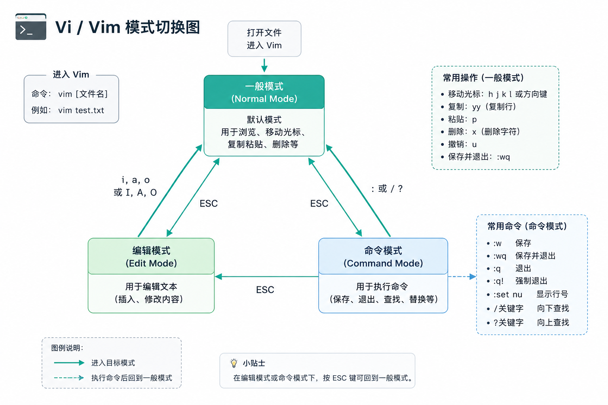

## VIM/VI

用于shell做文本编辑器，写一些文件等操作

### VIM/VI的模式

通过命令 vi 文件名，进入vi的文件的内部，查看文件并做一些操作，vi的操作一共有三种模式：

- 一般模式：删除、复制、粘贴 (默认模式)
- 命令模式：对文本进行命令操作，(:wq 保存并推出 :q 退出 :q! 强制推出)
- 编辑模式：使用键盘，来进行内容编辑

### 模式切换
* vim 文件   --->    一般模式
* 一般模式    ---(输入‘i/I’，‘a/A’，‘o/O’)---> 编辑模式
* 一般模式    ---(输入 '/' 查看命令  ':’进入命令模式)---> 命令模式
* 命令模式    ---(输入‘i/I’，‘a/A’，‘o/O’)---> 编辑模式
* 编辑模式    --- ESC ---> 一般模式

具体切换参考下图

### 常用命令 (基本操作)

- vim 文件名：进入单开并进入指定文件
- :wq 退出并保存
- :q 退出
- :q! 强制退出
- i/o/a 进入编辑模式
- esc 各个模式切换到一般模式
- /内容 查找文本内容
- *内容 查内容
