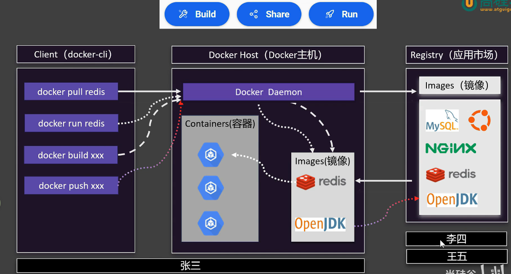

## Doker 命令执行流程



- 【拉镜像】

> 使用命令：docker pull xxx 在镜像市场或者docker hub中拉取指定的镜像到 Docker Host

- 【推送镜像】

> 使用命令：docker push xxx 将指定镜像推送到自己的docker hub厂库或者应用市场中

- 【构建镜像】

> 使用命令：dockers build xxx 通过编写的Dockerfile文件，将某个项目打包成一个镜像，存放再DockerHost为只

- 【运行镜像】

> 使用命令：docker run xxx 运行执行的Docker Host 的镜像，在一个容器中运行，保证环境的一致性

## 什么是容器？

容器是运行在Docker Host上的一个虚拟环境，容器中的所有进程都运行在一个虚拟的进程空间中，
容器之间是隔离的，容器之间不能相互访问。

## 以案例驱动学习docker

【要求】 ： 启动一个nginx 并且修改nginx的首页信息，发布出去，让所有人都能使用

---
【下载镜像】 --> 【启动容器】 --> 【修改容器】 --> 【保存镜像】 --> 【上传镜像】

- 【下载镜像】
    - 相关命令 docker xxx 镜像名:tag
        - 检索：docker search mysql
          ```shell
            [root@localhost xc]# docker search mysql
            NAME                   DESCRIPTION                                      STARS     OFFICIAL
            mysql                  MySQL is a widely used, open-source relation…   16124     [OK]
            circleci/mysql         MySQL is a widely used, open-source relation…   33        
            bitnamicharts/mysql    Bitnami Helm chart for MySQL                     1         
            cimg/mysql                                                              4         
            ubuntu/mysql           MySQL open source fast, stable, multi-thread…   74        
    
          ```
        - 下载：docker pull hello-world 下载到本机的Docker Host中
            ```shell
            [root@localhost xc]# docker pull hello-world
            Using default tag: latest
            latest: Pulling from library/hello-world
            4f55086f7dd0: Pull complete 
            Digest: sha256:0e760fdfbc48ba8041e7c6db999bb40bfca508b4be580ac75d32c4e29d202ce1
            Status: Downloaded newer image for hello-world:latest
            docker.io/library/hello-world:latest

            ```
        - 列表：docker images 用于查看当前Docker Host中的镜像
            ```shell
            [root@localhost xc]# docker images
            REPOSITORY          TAG       IMAGE ID       CREATED        SIZE
            hello-world         latest    e2ac70e7319a   7 weeks ago    10.1kB
            redis/redis-stack   latest    9eafe528d67a   6 months ago   895MB
            xc_flask_base       1.0.4     9418d3293435   7 months ago   140MB
            xc_flask_base       1.0.3     0a833736c86c   7 months ago   140MB
            ```
        - 删除：docker rmi xxx 删除某个镜像
            ```shell
            [root@localhost xc]# docker rmi hello-world
            Untagged: hello-world:latest
            Untagged: hello-world@sha256:0e760fdfbc48ba8041e7c6db999bb40bfca508b4be580ac75d32c4e29d202ce1
            Deleted: sha256:e2ac70e7319a02c5a477f5825259bd118b94e8b02c279c67afa63adab6d8685b
            Deleted: sha256:897b3f2a7c1bc2f3d02432f7892fe31c6272c521ad4d70257df624504a3238b4
            ```
        -
- 【启动容器/修改页面】
    - 运行：docker run -d --name mynginx -p 88:80 nginx
    ```shell
    命令使用参数：Usage:  docker run [OPTIONS] IMAGE [COMMAND] [ARG...]
    使用的参数按照情况而定，不同的项目和要求需要写不同的东西
    -d : 后台运行不占用·窗口
    -p 88:80 -> 端口映射 主机端口:容器端口(不同容器可以重复)
    --name mynginx : 容器起新的名字叫 mynginx(别名)
    --network bridge : 指定网络名，同一个网络下的容器可以相互访问
    -v /data/redis/6379/data:/data  ：挂载数据  主机数据位置:容器数据的位置  将容器内的数据持久化
    -e TZ=Asia/Shanghai ： 时区
    ... 
  
  
    ### 其他案例完整参数 以Redis6.2 为例子
    docker run -d \
    # 1. 后台守护进程运行
    --detach \
    # 2. 容器唯一名称，方便管理
    --name redis-master-6379 \
    # 3. 主机端口:容器端口 端口映射
    -p 6379:6379 \
    # 4. 绑定指定网卡（隔离网络，避免冲突）
    --network bridge \
    # 5. 容器IP固定（可选，集群必备）
    --ip 172.17.0.10 \
    # 6. 开机自启、容器退出自动重启
    --restart always \
    # 7. 数据持久化挂载（宿主机目录映射容器内部，删容器不丢数据）
    -v /data/redis/6379/data:/data \
    # 8. 配置文件挂载（外部统一管理配置）
    -v /data/redis/6379/conf/redis.conf:/etc/redis/redis.conf \
    # 9. 日志挂载，统一宿主机日志管理
    -v /data/redis/6379/logs:/var/log/redis \
    # 10. 设置系统时区，解决时间不一致
    -e TZ=Asia/Shanghai \
    # 11. 设定容器内环境变量
    -e REDIS_PASSWORD=123456 \
    # 12. 授予容器特权权限，解决权限不足、文件读写报错
    --privileged=true \
    # 13. 限制CPU，防止单容器占满整机资源
    --cpus 0.5 \
    # 14. 限制内存，OOM不影响宿主机
    --memory 512m \
    # 15. 内存交换限制
    --memory-swap 1g \
    # 16. 禁止容器获取宿主机敏感权限
    --security-opt seccomp=seccomp_default \
    # 17. 只读文件系统加固（安全）
    --read-only \
    # 18. 挂载临时可写目录（弥补read-only）
    --tmpfs /tmp:size=50m \
    # 19. 容器内部hostname自定义
    --hostname redis-master-6379 \
    # 20. 禁用IPv6（不需要可关闭）
    --disable-ipv6 \
    # 镜像版本 固定版本，杜绝环境漂移
    redis:6.2.19 \
    # 容器启动执行命令
    redis-server /etc/redis/redis.conf --appendonly yes
  
    ```
    - 查看: docker ps [-a]  查看运行中/所有的容器
    ```shell
    docker ps -a :查看所有容器
    docker ps : 查看运行中的容器
  
    [root@localhost xc]# docker ps -a
    CONTAINER ID   IMAGE         COMMAND    CREATED         STATUS                     PORTS     NAMES
    5fcb9e1ec6ab   hello-world   "/hello"   9 seconds ago   Exited (0) 8 seconds ago             vigorous_feynman

    [root@localhost xc]# docker ps
    CONTAINER ID   IMAGE         COMMAND    CREATED         STATUS              PORTS     NAMES
    ```
    - 停止 ：docker stop 3c3ce9664387(容器id/前几个字符)/happy_newton(容器别名)
    ```shell
    -- 通过别名和id的方式停止容器
    [xc@localhost ~]$ docker stop 3c3ce9664387
    3c3ce9664387
  
    [xc@localhost ~]$ docker stop happy_newton
    happy_newton

    ```
    - 启动: docker start 3c3ce9664387(容器id)/happy_newton(容器别名)
    ```shell
    [xc@localhost ~]$ docker start happy_newton  (别名)
    happy_newton
    [xc@localhost ~]$ docker ps -a
    CONTAINER ID   IMAGE         COMMAND                   CREATED         STATUS                     PORTS     NAMES
    3c3ce9664387   nginx         "/docker-entrypoint.…"   2 minutes ago   Up 6 seconds               80/tcp    happy_newton
    5fcb9e1ec6ab   hello-world   "/hello"                  5 minutes ago   Exited (0) 5 minutes ago             vigorous_feynman

    ```
    - 重启: docker restart 3c3ce9664387(容器id/前几个字符)/happy_newton(容器别名)
    ```shell
    [xc@localhost ~]$ docker restart 3c3ce9664387
    3c3ce9664387

    [xc@localhost ~]$ docker restart happy_newton
    happy_newton

    ```
    - 状态 docker stats 3c3ce9664387(容器id/前几个字符)/happy_newton(容器别名)
    ```shell
    -- 展示容器使用的情况
    [xc@localhost ~]$ docker stats happy_newton
  
    CONTAINER ID   NAME           CPU %     MEM USAGE / LIMIT     MEM %     NET I/O         BLOCK I/O    PIDS 
    3c3ce9664387   happy_newton   0.00%     3.824MiB / 1.635GiB   0.23%     4.68kB / 126B   0B / 4.1kB   3 

    ```
    - 日志 docker logs 3c3ce9664387(容器id/前几个字符)/happy_newton(容器别名)
    ```shell 
    -- 展示容器运行产生的日志信息
    [xc@localhost ~]$ docker logs happy_newton 
    /docker-entrypoint.sh: /docker-entrypoint.d/ is not empty, will attempt to perform configuration
    /docker-entrypoint.sh: Looking for shell scripts in /docker-entrypoint.d/
    /docker-entrypoint.sh: Launching /docker-entrypoint.d/10-listen-on-ipv6-by-default.sh
    ...
  
    ```
    - 进入:docker exec -it /bin/bash
    ```shell
    [xc@localhost ~]$ docker exec -it mynginx /bin/bash
    root@cb7040c458a7:/# 
  
    -it :交互模式
    /bin/bash ：交互的模式
  
    修改nginx的内置的index.html 文件
    ```
    - 删除 docker rm 5fc(容器id/前几个字符)/vigorous_feynman(容器别名)
    ```shell 
    [xc@localhost ~]$ docker rm 5fc
    5fc
    [xc@localhost ~]$ docker ps -a 
    CONTAINER ID   IMAGE     COMMAND                   CREATED          STATUS          PORTS     NAMES
    3c3ce9664387   nginx     "/docker-entrypoint.…"   33 minutes ago   Up 21 minutes   80/tcp    happy_newton
    [xc@localhost ~]$
    ```
    -
- 【保存镜像】
    - 提交:docekr commit -a 作者 -c 改变的列表 -m  提交的说明信息 -p 打包期间暂停容器运行 容器名/id 新镜像名:版本号
    ```shell
    xc@localhost ~]$ docker commit -a 'soc-feng' -m '6.1 er tong jie html' mynginx nginx_index_61
    sha256:8c4911d699dcf2f97d4c460a77d195d855c161e12cc60162029c645da62f8326
    [xc@localhost ~]$ docker images
    REPOSITORY          TAG       IMAGE ID       CREATED         SIZE
    nginx_index_61      latest    8c4911d699dc   6 seconds ago   161MB

    ```
    - 保存 docker save -o 文件名 镜像名:版本号
    ```shell
    -- 将镜像保存成一个文件
    docker save -o nginx_index_61.tar nginx_index_61:latest
  
    [xc@localhost ~]$ ls
    公共  视频  文档  音乐  compat-openssl10-1.0.2o-3.el8.x86_64.rpm    dump.rdb            RPM-GPG-KEY-mysql
    模板  图片  下载  桌面  compat-openssl10-1.0.2o-3.el8.x86_64.rpm.1  nginx_index_61.tar

    ```
    - 加载 docker load -i nginx_index_61.tar
    ```shell
    -- 加载一个镜像的tar包
    [xc@localhost ~]$ docker load -i nginx_index_61.tar
    327a7afc73f1: Loading layer [==================================================>]  27.65kB/27.65kB
    Loaded image: nginx_index_61:latest
    [xc@localhost ~]$ docker images
    REPOSITORY          TAG       IMAGE ID       CREATED         SIZE
    nginx_index_61      latest    8c4911d699dc   8 minutes ago   161MB
    nginx               latest    6f8edba05e38   3 days ago      161MB

    ```
- 【上传镜像】
  - 上传 docker push 镜像名:版本号 
  - 改名 docker tag 镜像名:版本号 新镜像名:新版本号


