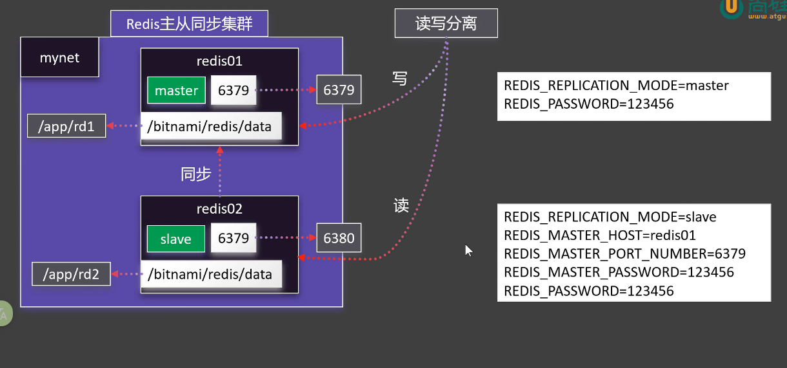

## 使用docker 启动一个Redis的集群服务


- 【主节点】
```shell
docker run -d \
-p 8100:6379 \
-v /home/xc/local_redis/redis_master/data:/data \
--network net1 \
--name redis_master \
--restart always \
redis:6.2 \
redis-server --requirepass 123456 --appendonly yes
---- 这是指定redis启动的参数
redis-server --requirepass 123456 --appendonly yes

```
- 【从节点】
```shell
docker run -d \
-p 8200:6379 \
-v /home/xc/local_redis/redis_slave/data:/data \
--network net1 \
--name redis_slave \
--restart always \
redis:6.2 \
redis-server --requirepass 123456 --masterauth 123456 --replicaof redis_master 6379 --appendonly yes
```
- 【验证】
```shell
docker exec -it redis_master redis-cli -a 123456 INFO replication


[root@localhost xc]# docker exec -it redis_master redis-cli -a 123456 INFO replication
Warning: Using a password with '-a' or '-u' option on the command line interface may not be safe.
# Replication
role:master
connected_slaves:1
slave0:ip=172.19.0.3,port=6379,state=online,offset=14,lag=0,io-thread=0
master_failover_state:no-failover
master_replid:62f5a1a0de4d543ef01baeb53a0115acbb8746f1
master_replid2:0000000000000000000000000000000000000000
master_repl_offset:14
second_repl_offset:-1
repl_backlog_active:1
repl_backlog_size:1048576
repl_backlog_first_byte_offset:1
repl_backlog_histlen:14

```