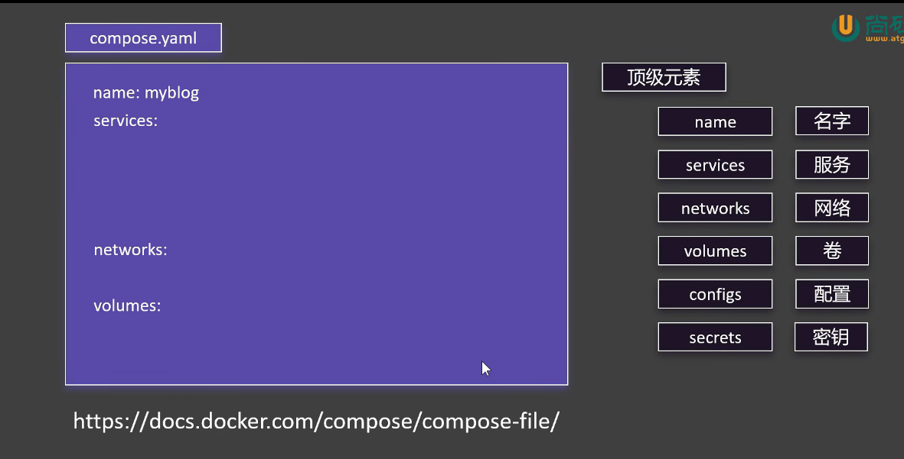

## Docker Compose

批量管理docker 容器的应用,通过yaml文件批量管理和配置

- 【上线】
    - docker compose up -d
  ```shell
  -- 以后台的方式启动 yaml中所配置的所有容器
  ```
- 【下线】
    - docker compose down
  ```shell
  --- 批量下线容器
  ```
- 【启动】
    - docker compose start x1 x2 x3...
    ```shell
    -- 指定启动compose的应用
    ```
- 【停止】
    - docker compose stop x1 x2 x3...
    ```shell
    -- 指定停止compose的应用
    ```
- 【扩容】
    - docker compose scale x1=3
    ```shell
    -- 指定的应用启动3份
    ```

## Compose.yaml 编写
如何编写compose.yaml文件

```shell
name: myblog # compose名称
services: # 服务列表
  mysql:  #mysql 服务
    container_name: mysql #运行后容器的名称
    image: mysql # 使用的镜像
    ports:  # 暴露的端口 - 表示多个 这里只写了一个
      - "3306:3306"
    environment: # 设置环境变量
      - MYSQL_ROOT_PASSWORD=123456
      - MYSQL_DATABASE=wordpress
    volumes: # 挂宅的文件（卷要拆出来表示 volumes）
      - mysql-data:/var/lib/mysql
      - /app/myconf:/etc/mysql/conf.d
    restart: always  # 重启
    networks: # 使用网络
      - blog

  wordpress: # 服务
    image: wordpress # 使用镜像名
    ports:
      - "8080:80"
    environment:
      WORDPRESS_DB_HOST: mysql
      WORDPRESS_DB_USER: root
      WORDPRESS_DB_PASSWORD: 123456
      WORDPRESS_DB_NAME: wordpress
    volumes:
      - wordpress:/var/www/html
    restart: always
    networks:
      - blog
    depends_on:  # 以来那个服务
      - mysql

networks:
  blog:

volumes:
  mysql-data:
  wordpress:
```