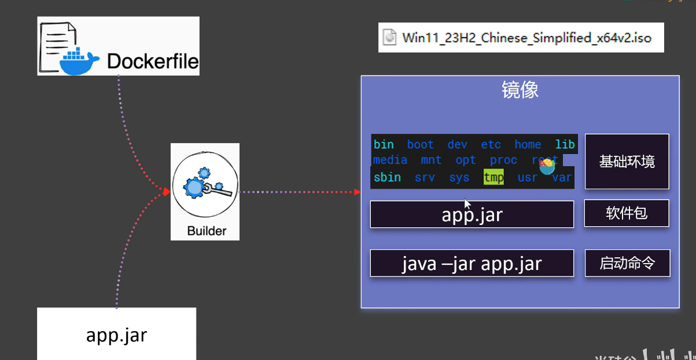

## Dockerfile

根据Dockerfile 文件将项目创建为并打包成一个镜像



### 打包镜像的要求

- 【基础环境】
- 【软件包】
- 【启动命令】

### Dockerfile常见指令

详细地址:https://docs.docker.com/reference/dockerfile/

- FROM 指定镜像的基础环境[python/jdk/...]
- RUN 运行定义的命令
- CMD 容器启动命令或者参数
- LABEL 自定义标签
- EXPOSE 指定暴露的端口
- ENV 环境变量
- ADD 添加文件到镜像
- COPY 复制文件到镜像
- ENTRYPOINT 容器固定启动命令
- VOLUME 数据卷
- USER 指定用户组
- WORKDIR 指定默认工作目录
- ARG 指定构建参数
```shell
# ==============================
# 1. 固定基础镜像 → 解决环境不一致
# ==============================
FROM python:3.11-slim
# ==============================
# 2. 元数据信息
# ==============================
LABEL author="xc"
LABEL description="Python项目标准化容器，彻底解决环境不一致、版本冲突、部署麻烦、虚拟机笨重"

# ==============================
# 3. 统一时区
# ==============================
ENV TZ=Asia/Shanghai
RUN ln -snf /usr/share/zoneinfo/$TZ /etc/localtime && echo $TZ > /etc/timezone

# ==============================
# 4. 设置工作目录（统一路径）
# ==============================
WORKDIR /app

# ==============================
# 5. 先拷贝依赖文件 → 锁定版本 → 解决版本冲突
# ==============================
COPY requirements.txt .

# ==============================
# 6. 安装依赖（固定版本）
# ==============================
RUN pip install --no-cache-dir -r requirements.txt -i https://pypi.tuna.tsinghua.edu.cn/simple

# ==============================
# 7. 拷贝整个项目代码
# ==============================
COPY . .

# ==============================
# 8. 暴露端口（根据你的项目改）
# ==============================
EXPOSE 8080

# ==============================
# 9. 启动命令（根据你的入口文件改）
# ==============================
CMD ["python", "app.py"]

```

- 【构建镜像】
  - 【构建】：docker build [-f Dockerfile] -t 镜像名:版本 .
  ```shell
  镜像进入构建环节 -- 等待完整 会有一个镜像，放在docker仓库中
  ```
